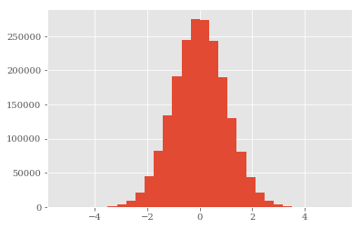

# 1 Input-Output Operations(Python基本 I/O)

## 1.1 将对象写入磁盘(Writing Objects to Disk) ---- pickle


```python
from pylab import plt
plt.style.use('ggplot')
import matplotlib as mpl
mpl.rcParams['font.family'] = 'serif'
```


```python
path = './data/'
```


```python
import numpy as np
from random import gauss
```


```python
a = [gauss(1.5, 2) for i in range(1000000)]
  # generation of normally distributed randoms
```


```python
import pickle
```


```python
pkl_file = open(path + 'data.pkl', 'wb')
  # open file for writing
  # Note: existing file might be overwritten
```


```python
%time pickle.dump(a, pkl_file)
```

    Wall time: 42.2 ms
    


```python
pkl_file
```


    <_io.BufferedWriter name='./data/data.pkl'>


```python
pkl_file.close()
```

通过pickle.load将磁盘数据读进内存：


```python
pkl_file = open(path + 'data.pkl', 'rb')  # open file for reading
```


```python
%time b = pickle.load(pkl_file)
```

    Wall time: 77.2 ms
    


```python
b[:5]
```


    [0.13454237192312468,
     0.9655128972849463,
     1.4369615710243926,
     -0.47671804254947125,
     2.0888316343599134]


```python
a[:5]
```


    [0.13454237192312468,
     0.9655128972849463,
     1.4369615710243926,
     -0.47671804254947125,
     2.0888316343599134]


```python
np.allclose(np.array(a), np.array(b))  # 判断a与b是否相同(容错级别参数默认值为1e-5)
```


    True


```python
np.sum(np.array(a) - np.array(b))    # 判断a与b是否相同
```


    0.0


pickle存取两个对象：


```python
pkl_file = open(path + 'data.pkl', 'wb')  # open file for writing
```


```python
%time pickle.dump(np.array(a), pkl_file)
```

    Wall time: 56.9 ms
    


```python
%time pickle.dump(np.array(a) ** 2, pkl_file)
```

    Wall time: 47.5 ms
    


```python
pkl_file.close()
```


```python
pkl_file = open(path + 'data.pkl', 'rb')  # open file for reading
```

pickle.load只返回一个ndarray对象


```python
x = pickle.load(pkl_file)
x
```


    array([ 0.13454237,  0.9655129 ,  1.43696157, ...,  3.89512711,
           -0.36354624,  3.91178187])


第二次调用pickle.load返回第二个ndarray对象


```python
y = pickle.load(pkl_file)
y
```


    array([  0.01810165,   0.93221515,   2.06485856, ...,  15.17201523,
             0.13216587,  15.30203742])


```python
pkl_file.close()
```

显然，pickle 按照*先进先出(FIFO)*原则保存对象。这样会有一个麻烦：     
    没有任何可用的元信息，让用户事先知道保存在pickle中的文件是什么。
    可以采取一个变通的方法，来解决此问题：
    不存储单个对象，而是存储包含所有其他对象的字典对象


```python
pkl_file = open(path + 'data.pkl', 'wb')  # open file for writing
pickle.dump({'x' : x, 'y' : y}, pkl_file)
pkl_file.close()
```


```python
pkl_file = open(path + 'data.pkl', 'rb')  # open file for writing
data = pickle.load(pkl_file)
pkl_file.close()
for key in data.keys():
    print(key, data[key][:4])
```

    x [ 0.13454237  0.9655129   1.43696157 -0.47671804]
    y [ 0.01810165  0.93221515  2.06485856  0.22726009]
    

## 1.2 Reading and Writing Text Files  ---- CSV
保存为CSV文件(逗号分隔值)


```python
rows = 5000
a = np.random.standard_normal((rows, 5))  # dummy data
```


```python
a.round(4)
```


    array([[-0.9518, -0.9554, -0.0562,  0.5444,  0.6314],
           [ 1.238 , -0.2555, -0.787 ,  0.7734, -1.0622],
           [ 1.6467,  0.1277,  1.7641, -0.0403,  0.6521],
           ..., 
           [ 0.7101,  0.5007,  0.9284,  0.4819,  0.2105],
           [ 0.8781, -0.3101, -0.357 ,  0.9274, -0.0235],
           [ 1.2666, -0.0502, -0.7394,  0.4456,  0.7142]])


```python
import pandas as pd
t = pd.date_range(start='2014/1/1', periods=rows, freq='H')
    # set of hourly datetime objects
```


```python
t
```


    DatetimeIndex(['2014-01-01 00:00:00', '2014-01-01 01:00:00',
                   '2014-01-01 02:00:00', '2014-01-01 03:00:00',
                   '2014-01-01 04:00:00', '2014-01-01 05:00:00',
                   '2014-01-01 06:00:00', '2014-01-01 07:00:00',
                   '2014-01-01 08:00:00', '2014-01-01 09:00:00',
                   ...
                   '2014-07-27 22:00:00', '2014-07-27 23:00:00',
                   '2014-07-28 00:00:00', '2014-07-28 01:00:00',
                   '2014-07-28 02:00:00', '2014-07-28 03:00:00',
                   '2014-07-28 04:00:00', '2014-07-28 05:00:00',
                   '2014-07-28 06:00:00', '2014-07-28 07:00:00'],
                  dtype='datetime64[ns]', length=5000, freq='H')


```python
csv_file = open(path + 'data.csv', 'w')  # open file for writing
```

CSV文件的第一行通常包含保存在文件中的每个数据列的名称：


```python
header = 'date,no1,no2,no3,no4,no5\n'
csv_file.write(header)
```


    25


方法1：逐行写入数据，将日期-时间与(伪)随机数合并：


```python
for t_, (no1, no2, no3, no4, no5) in zip(t, a):
    s = '%s,%f,%f,%f,%f,%f\n' % (t_, no1, no2, no3, no4, no5)
    csv_file.write(s)
csv_file.close()
```

方法2：使用文件对象的readline方法逐行读入数据：


```python
csv_file = open(path + 'data.csv', 'r')  # open file for reading
```


```python
for i in range(5):
    print(csv_file.readline(), end='')
```

    date,no1,no2,no3,no4,no5
    2014-01-01 00:00:00,-0.951842,-0.955441,-0.056153,0.544383,0.631414
    2014-01-01 01:00:00,1.237976,-0.255498,-0.787032,0.773352,-1.062244
    2014-01-01 02:00:00,1.646652,0.127724,1.764102,-0.040311,0.652121
    2014-01-01 03:00:00,-0.556363,0.063348,0.758784,-0.662072,1.314580
    

方法3：使用文件对象的readlines一次读入所有内容：


```python
csv_file = open(path + 'data.csv', 'r')
content = csv_file.readlines()
for line in content[:5]:
    print(line, end='')
```

    date,no1,no2,no3,no4,no5
    2014-01-01 00:00:00,-0.951842,-0.955441,-0.056153,0.544383,0.631414
    2014-01-01 01:00:00,1.237976,-0.255498,-0.787032,0.773352,-1.062244
    2014-01-01 02:00:00,1.646652,0.127724,1.764102,-0.040311,0.652121
    2014-01-01 03:00:00,-0.556363,0.063348,0.758784,-0.662072,1.314580
    


```python
csv_file.close()
```

## 1.3 SQL Databases(SQL数据库)

Python可以使用任何类型的SQL数据库，通常也可以使用NoSQL数据库。      
默认自带SQLite3数据库(<http://www.sqlite.org>)

数据库领域中的另一个“一等公民”是MySQL，Python和它的集成也非常好。


```python
import sqlite3 as sq3
```

SQL查询用**字符串对象**表示。


```python
query = 'CREATE TABLE numbs (Date date, No1 real, No2 real)'
```

打开一个数据库连接


```python
con = sq3.connect(path + 'numbs.db')
```

使用`execute`方法执行查询语句，创建一个表：


```python
con.execute(query)
```


    <sqlite3.Cursor at 0x18ec327da40>


调用 `commit` 方法使查询生效：


```python
con.commit()
```

现在我们有了一个数据库和一个表，可以在表中填入数据。每个数据行由日期-时间信息和两个浮点数组成：


```python
import datetime as dt
```

可用单独的SQL语句写入单一数据行：


```python
con.execute('INSERT INTO numbs VALUES(?, ?, ?)',
            (dt.datetime.now(), 0.12, 7.3))
```


    <sqlite3.Cursor at 0x18ec327dc70>


也可批量写入：


```python
data = np.random.standard_normal((10000, 2)).round(5)
```


```python
for row in data:
    con.execute('INSERT INTO numbs VALUES(?, ?, ?)',
                (dt.datetime.now(), row[0], row[1]))
con.commit()
```

还有一个 `executemany` 方法，在此我们不用它，但是可以使用 `fetchmany` 方法一次从数据库中读取一定数量的行:


```python
con.execute('SELECT * FROM numbs').fetchmany(10)
```


    [('2017-09-11 20:02:33.658333', 0.12, 7.3),
     ('2017-09-11 20:02:49.660563', 0.83796, 0.17645),
     ('2017-09-11 20:02:49.660563', -1.6481, -0.4717),
     ('2017-09-11 20:02:49.660563', -0.06092, 3.2521),
     ('2017-09-11 20:02:49.660563', -0.77152, -0.14834),
     ('2017-09-11 20:02:49.660563', -0.22591, 1.58812),
     ('2017-09-11 20:02:49.660563', 0.34184, -1.82709),
     ('2017-09-11 20:02:49.660563', -0.14259, 0.00706),
     ('2017-09-11 20:02:49.660563', 1.49833, -2.3098),
     ('2017-09-11 20:02:49.660563', 0.74328, 0.53082)]


也可以一次只读入一个数据行：


```python
pointer = con.execute('SELECT * FROM numbs')
```


```python
for i in range(3):
    print(pointer.fetchone())
```

    ('2017-09-11 20:02:33.658333', 0.12, 7.3)
    ('2017-09-11 20:02:49.660563', 0.83796, 0.17645)
    ('2017-09-11 20:02:49.660563', -1.6481, -0.4717)
    


```python
con.close()
```

1. Python和几乎所有的数据库技术都能很好的集成。
2. 基本SQL语法主要由使用的数据库绝定；剩下的都是真正的Python风格。

## 1.4 Writing and Reading Numpy Arrays


```python
import numpy as np
```

使用Numpy的arange函数代替pandas，生成保存日期时间(datetime)对象的数组对象(<http://docs.scipy.org/doc/numpy/reference/arrays.datetime.html>)


```python
dtimes = np.arange('2015-01-01 10:00:00', '2021-12-31 22:00:00',
                  dtype='datetime64[m]')  # minute intervals
len(dtimes)
```


    3681360


SQL数据库中的表是NumPy中的结构数组。我们使用dtype对象镜像前面的SQL表。


```python
dty = np.dtype([('Date', 'datetime64[m]'), ('No1', 'f'), ('No2', 'f')])
data = np.zeros(len(dtimes), dtype=dty)
```

用**日期(dates)**对象填充Date列


```python
data['Date'] = dtimes
```


```python
a = np.random.standard_normal((len(dtimes), 2)).round(5)
data['No1'] = a[:, 0]
data['No2'] = a[:, 1]
```


```python
%time np.save(path + 'array', data)  # suffix .npy is added
```

    Wall time: 153 ms
    


```python
%time np.load(path + 'array.npy')
```

    Wall time: 46.9 ms
    


    array([('2015-01-01T10:00', -0.16445   , -1.33667004),
           ('2015-01-01T10:01', -1.59417999,  0.79244   ),
           ('2015-01-01T10:02', -0.01763   ,  0.28310001), ...,
           ('2021-12-31T21:57',  2.18754005,  2.36051989),
           ('2021-12-31T21:58',  0.13085   ,  0.2832    ),
           ('2021-12-31T21:59', -1.73157001,  0.54874003)],
          dtype=[('Date', '<M8[m]'), ('No1', '<f4'), ('No2', '<f4')])


```python
data = np.random.standard_normal((10000, 6000))
```


```python
%time np.save(path + 'array', data) 
```

    Wall time: 1.58 s
    


```python
%time np.load(path + 'array.npy')
```

    Wall time: 312 ms
    


    array([[-0.93655507,  1.54786912,  0.01611597, ..., -0.2194081 ,
            -0.06569949, -0.39409736],
           [-0.87839706,  2.36978823,  0.68514197, ..., -1.58175291,
             1.03539306, -0.23500559],
           [ 0.46009783, -0.79337858,  0.45486177, ...,  0.28813881,
            -1.01151433,  0.63172618],
           ..., 
           [ 0.76873306, -0.10826964,  1.2180736 , ..., -0.07367605,
             1.82265585, -0.01307792],
           [-1.64569764, -0.56645602, -0.41520243, ...,  1.61880077,
            -1.37676341, -0.08365204],
           [ 0.1364718 ,  1.65981851, -1.64191807, ...,  1.62175144,
             1.09407214, -0.55633609]])


```python
data = 0.0
```


```python
ls data
```

     驱动器 C 中的卷是 Windows
     卷的序列号是 1E3D-4470
    
     C:\Users\xiner\Source\Repos\MyStudy\content\data 的目录
    
    2017/09/11  20:20    <DIR>          .
    2017/09/11  20:20    <DIR>          ..
    2017/09/11  20:29       480,000,080 array.npy
    2017/09/11  19:41           342,630 data.csv
    2017/09/11  19:37        16,000,267 data.pkl
    2017/09/11  18:43           688,500 es.txt
    2017/09/11  20:02           520,192 numbs.db
    2017/09/11  18:44           363,485 vs.txt
                   6 个文件    497,915,154 字节
                   2 个目录 144,990,814,208 可用字节
    

由上述信息可以看出这种形式的数据存储和检索远快于SQL数据库或者使用标准pickle库的序列化。当然使用这种方法没有SQL数据库的功能性，
但是使用PyTables可以克服此缺点。

# 2 I/O with pandas

pandas库的主要优势之一是可以原生读取和写入不同的数据格式，包括：     

1. CSV(逗号分隔值)
2. SQL(结构化查询语言)
3. XLS/XLSX(Microsoft Excel 文件)
4. JSON(JavaScript对象标记法)
5. HTML(超文本标记语言)

###### DataFrame函数参数

格式|输入|输出|备注
:-|:-|:-|:-
`CSV`|`read_csv`|`to_csv`|文本文件
`XLS/XLSX`|`read_excel`|`to_excel`|电子表格
`HDF`|`read_hdf`|`to_hdf`|HDF5数据库
`SQL`|`read_sql`|`to_sql`|SQL表
`JSON`|`read_json`|`to_json`|JavaScript对象标记法
`MSGPACK`|`read_msgpack`|`to_msgpack`|可移植二进制格式
`HTML`|`read_html`|`to_html`|HTML代码
`GBQ`|`read_gbq`|`to_gbq`|Google Big Query格式
`DTA`|`read_stata`|`to_stata`|格式104，105，108，113-115，117
`任意`|`read_clipboard`|`to_clipboard`|例如，从HTML页面
`任意`|`read_pickle`|`to_pickle`|(结构化)Python对象


```python
import numpy as np
import pandas as pd
data = np.random.standard_normal((1000000, 5)).round(5)
        # sample data set
```


```python
filename = path + 'numbs'
```

## 2.1 SQL Database


```python
import sqlite3 as sq3
```


```python
query = 'CREATE TABLE numbers (No1 real, No2 real,\
        No3 real, No4 real, No5 real)'
```


```python
con = sq3.Connection(filename + '.db')
```


```python
con.execute(query)
```


    <sqlite3.Cursor at 0x18ec327df10>


因为我们从单个ndarray对象写入，故可以使用executemany方法：


```python
%%time
con.executemany('INSERT INTO numbers VALUES (?, ?, ?, ?, ?)', data)
con.commit()
```

    Wall time: 8.24 s
    

写入100万行的整个数据集要花上一段时间。将整个表格读入一个列表对象则要快得多：


```python
%%time
temp = con.execute('SELECT * FROM numbers').fetchall()
print(temp[:2])
temp = 0.0
```

    [(-0.73736, 0.41511, 0.60309, 1.28584, -0.51162), (0.00431, -0.96197, -0.99594, -0.02693, -0.29152)]
    Wall time: 1.63 s
    


```python
%%time
query = 'SELECT * FROM numbers WHERE No1 > 0 AND No2 < 0'
res = np.array(con.execute(query).fetchall()).round(3)
```

    Wall time: 721 ms
    


```python
res = res[::100]  # every 100th result
import matplotlib.pyplot as plt
%matplotlib inline
plt.plot(res[:, 0], res[:, 1], 'ro')
plt.grid(True); plt.xlim(-0.5, 4.5); plt.ylim(-4.5, 0.5)
# tag: scatter_query
# title: Plot of the query result
# size: 60
```


    (-4.5, 0.5)


## 2.2 From SQL to pandas

使用pandas读取整个表或查询结果通常更为高效。在可以将整个表读入内存时，分析查询的执行通常比使用基于磁盘的SQL方法快得多。


```python
import pandas.io.sql as pds   # pandas.io.sql子库包含处理SQL数据库中保存数据的函数
```

用pandas读取整个表花费的总时间和读入NumPy ndarray对象的时间大致相同。瓶颈同样在SQL数据库。


```python
%time data = pds.read_sql('SELECT * FROM numbers', con)
```

    Wall time: 2.26 s
    


```python
data.head()
```


<div>
<style>
    .dataframe thead tr:only-child th {
        text-align: right;
    }

    .dataframe thead th {
        text-align: left;
    }

    .dataframe tbody tr th {
        vertical-align: top;
    }
</style>
<table border="1" class="dataframe">
  <thead>
    <tr style="text-align: right;">
      <th></th>
      <th>No1</th>
      <th>No2</th>
      <th>No3</th>
      <th>No4</th>
      <th>No5</th>
    </tr>
  </thead>
  <tbody>
    <tr>
      <th>0</th>
      <td>-0.73736</td>
      <td>0.41511</td>
      <td>0.60309</td>
      <td>1.28584</td>
      <td>-0.51162</td>
    </tr>
    <tr>
      <th>1</th>
      <td>0.00431</td>
      <td>-0.96197</td>
      <td>-0.99594</td>
      <td>-0.02693</td>
      <td>-0.29152</td>
    </tr>
    <tr>
      <th>2</th>
      <td>0.63104</td>
      <td>1.63309</td>
      <td>-0.81852</td>
      <td>-0.58061</td>
      <td>0.13542</td>
    </tr>
    <tr>
      <th>3</th>
      <td>-2.26673</td>
      <td>0.92052</td>
      <td>1.06539</td>
      <td>-0.09844</td>
      <td>-0.51995</td>
    </tr>
    <tr>
      <th>4</th>
      <td>0.12293</td>
      <td>-0.31418</td>
      <td>1.90292</td>
      <td>-0.46126</td>
      <td>0.46839</td>
    </tr>
  </tbody>
</table>
</div>


数据现在在内存中，可以进行更快的分析。


```python
%time data[(data['No1'] > 0) & (data['No2'] < 0)].head()
```

    Wall time: 37.8 ms
    


<div>
<style>
    .dataframe thead tr:only-child th {
        text-align: right;
    }

    .dataframe thead th {
        text-align: left;
    }

    .dataframe tbody tr th {
        vertical-align: top;
    }
</style>
<table border="1" class="dataframe">
  <thead>
    <tr style="text-align: right;">
      <th></th>
      <th>No1</th>
      <th>No2</th>
      <th>No3</th>
      <th>No4</th>
      <th>No5</th>
    </tr>
  </thead>
  <tbody>
    <tr>
      <th>1</th>
      <td>0.00431</td>
      <td>-0.96197</td>
      <td>-0.99594</td>
      <td>-0.02693</td>
      <td>-0.29152</td>
    </tr>
    <tr>
      <th>4</th>
      <td>0.12293</td>
      <td>-0.31418</td>
      <td>1.90292</td>
      <td>-0.46126</td>
      <td>0.46839</td>
    </tr>
    <tr>
      <th>6</th>
      <td>2.12922</td>
      <td>-0.48351</td>
      <td>-0.67892</td>
      <td>1.39594</td>
      <td>-0.84261</td>
    </tr>
    <tr>
      <th>8</th>
      <td>1.52814</td>
      <td>-0.60705</td>
      <td>-1.42480</td>
      <td>0.68020</td>
      <td>0.46274</td>
    </tr>
    <tr>
      <th>9</th>
      <td>1.24175</td>
      <td>-1.12008</td>
      <td>1.13520</td>
      <td>-1.49722</td>
      <td>0.64355</td>
    </tr>
  </tbody>
</table>
</div>


pandas能够控制更为复杂的查询，但是不能替换结构复杂的关系型数据结构。


```python
%%time
res = data[['No1', 'No2']][((data['No1'] > 0.5) | (data['No1'] < -0.5))
                     & ((data['No2'] < -1) | (data['No2'] > 1))]
```

    Wall time: 37.8 ms
    


```python
plt.plot(res.No1, res.No2, 'ro')
plt.grid(True); plt.axis('tight')
# tag: data_scatter_1
# title: Scatter plot of complex query results
# size: 55
```


    (-5.1781425000000008, 5.1764325000000007, -5.159605, 4.9290449999999995)


正如预期，只要pandas可以复制对应的SQL语句，使用pandas的内存分析能力可以大大加速。


```python
h5s = pd.HDFStore(filename + '.h5s', 'w')
```


```python
%time h5s['data'] = data
```

    Wall time: 193 ms
    


```python
h5s
```


    <class 'pandas.io.pytables.HDFStore'>
    File path: ./data/numbs.h5s
    /data            frame        (shape->[1000000,5])


```python
h5s.close()
```


```python
%%time
h5s = pd.HDFStore(filename + '.h5s', 'r')
temp = h5s['data']
h5s.close()
```

    Wall time: 53.9 ms
    


```python
np.allclose(np.array(temp), np.array(data))   # 检查两个数据集是否确实相同
```


    True


```python
temp = 0.0
```

1. 写入SQLite3数据花费数秒，而使用pandas花费不到1秒
2. 从SQL数据库读取数据花费数秒，而pandas花费不到0.1秒。

## 2.3 Data as CSV File

Python标准功能用来存储CSV文件，显得十分繁琐，但是使用pandas一行代码即可搞定：


```python
%time data.to_csv(filename + '.csv')
```

    Wall time: 7.68 s
    


```python
ls data
```

     驱动器 C 中的卷是 Windows
     卷的序列号是 1E3D-4470
    
     C:\Users\xiner\Source\Repos\MyStudy\content\data 的目录
    
    2017/09/11  21:04    <DIR>          .
    2017/09/11  21:04    <DIR>          ..
    2017/09/11  20:29       480,000,080 array.npy
    2017/09/11  19:41           342,630 data.csv
    2017/09/11  19:37        16,000,267 data.pkl
    2017/09/11  18:43           688,500 es.txt
    2017/09/11  21:04        49,834,664 numbs.csv
    2017/09/11  21:01        53,149,696 numbs.db
    2017/09/11  21:04        48,007,192 numbs.h5s
    2017/09/11  18:44           363,485 vs.txt
                   8 个文件    648,386,514 字节
                   2 个目录 144,844,705,792 可用字节
    

代码简洁，且执行速度快。    
读取CSV数据，并绘制图表由`read_csv`函数实现。


```python
%%time
pd.read_csv(filename + '.csv')[['No1', 'No2',
                                'No3', 'No4']].hist(bins=20)
# tag: data_hist_3
# title: Histogram of 4 data sets
# size: 60
```

    Wall time: 1.47 s
    


    array([[<matplotlib.axes._subplots.AxesSubplot object at 0x0000018EC4917EB8>,
            <matplotlib.axes._subplots.AxesSubplot object at 0x0000018EDEF91FD0>],
           [<matplotlib.axes._subplots.AxesSubplot object at 0x0000018ECC3E8E10>,
            <matplotlib.axes._subplots.AxesSubplot object at 0x0000018EC33B3EF0>]], dtype=object)


## 2.4 Data as Excel File


```python
%time data[:100000].to_excel(filename + '.xlsx')   # 写入数据进入Excel表格。
```

    Wall time: 13.3 s
    


```python
%time pd.read_excel(filename + '.xlsx', 'Sheet1').cumsum().plot()
# tag: data_paths
# title: Paths of random data from Excel file
# size: 60
```

    Wall time: 6.36 s
    


    <matplotlib.axes._subplots.AxesSubplot at 0x18ec403b9e8>


同样的数据量若使用CSV文件存储，文件尺寸会更大。这是使用CSV文件的性能较低的原因之一。

# 3 Fast I/O with PyTables

PyTables 是Python 与HDF5数据库/文件标准的结合(<http://www.hdfgroup.org>)。它专门为优化I/O操作的性能、最大限度地利用可用硬件而设计。    
该库的导入名称为`tables`。在内存分析方面，PyTables 与 pandas类似，并不是用于代替SQL数据库的，而是引入某些功能，进一步弥补不足。


```python
import numpy as np
import tables as tb
import datetime as dt
import matplotlib.pyplot as plt
%matplotlib inline
```

PyTables数据库可以有许多表，且支持压缩和索引，以及表的重要查询。此外，它可以高效的存储NumPy数组，且具有自己独特的类数组数据结构。

## 3.1 Working with Tables(使用表)
PyTable提供基于文件的数据库格式：


```python
filename = path + 'tab.h5'
h5 = tb.open_file(filename, 'w') 
```


```python
rows = 2000000   # 生成一个具有200万行数据的表
```

这个表本身有一个**datetime**列，两个**int**列和两个**float**列：


```python
row_des = {
    'Date': tb.StringCol(26, pos=1),
    'No1': tb.IntCol(pos=2),
    'No2': tb.IntCol(pos=3),
    'No3': tb.Float64Col(pos=4),
    'No4': tb.Float64Col(pos=5)
    }
```

在此，创建表格时我们选择无压缩：


```python
filters = tb.Filters(complevel=0)  # no compression
tab = h5.create_table('/', 'ints_floats', row_des,
                      title='Integers and Floats',
                      expectedrows=rows, filters=filters)
```


```python
tab
```


    /ints_floats (Table(0,)) 'Integers and Floats'
      description := {
      "Date": StringCol(itemsize=26, shape=(), dflt=b'', pos=0),
      "No1": Int32Col(shape=(), dflt=0, pos=1),
      "No2": Int32Col(shape=(), dflt=0, pos=2),
      "No3": Float64Col(shape=(), dflt=0.0, pos=3),
      "No4": Float64Col(shape=(), dflt=0.0, pos=4)}
      byteorder := 'little'
      chunkshape := (2621,)


```python
pointer = tab.row
```

现在我们生成样本数据：


```python
ran_int = np.random.randint(0, 10000, size=(rows, 2))
ran_flo = np.random.standard_normal((rows, 2)).round(5)
```

样本数据集逐行写入表：


```python
%%time
for i in range(rows):
    pointer['Date'] = dt.datetime.now()
    pointer['No1'] = ran_int[i, 0]
    pointer['No2'] = ran_int[i, 1] 
    pointer['No3'] = ran_flo[i, 0]
    pointer['No4'] = ran_flo[i, 1] 
    pointer.append()
      # this appends the data and
      # moves the pointer one row forward
tab.flush()
```

    Wall time: 6.36 s
    

一定要记住提交更改。SQLite3数据库中的`commit`命令的作用,在PyTables中由**`flush`**方法实现。

我们现在来检查磁盘数据：    
首先从逻辑上通过Table对象，然后从物理上通过文件信息进行：


```python
tab
```


    /ints_floats (Table(2000000,)) 'Integers and Floats'
      description := {
      "Date": StringCol(itemsize=26, shape=(), dflt=b'', pos=0),
      "No1": Int32Col(shape=(), dflt=0, pos=1),
      "No2": Int32Col(shape=(), dflt=0, pos=2),
      "No3": Float64Col(shape=(), dflt=0.0, pos=3),
      "No4": Float64Col(shape=(), dflt=0.0, pos=4)}
      byteorder := 'little'
      chunkshape := (2621,)


```python
ls data
```

     驱动器 C 中的卷是 Windows
     卷的序列号是 1E3D-4470
    
     C:\Users\xiner\Source\Repos\MyStudy\content\data 的目录
    
    2017/09/12  10:16    <DIR>          .
    2017/09/12  10:16    <DIR>          ..
    2017/09/11  20:29       480,000,080 array.npy
    2017/09/11  19:41           342,630 data.csv
    2017/09/11  19:37        16,000,267 data.pkl
    2017/09/11  18:43           688,500 es.txt
    2017/09/11  21:04        49,834,664 numbs.csv
    2017/09/11  21:01        53,149,696 numbs.db
    2017/09/11  21:04        48,007,192 numbs.h5s
    2017/09/11  21:06         4,417,914 numbs.xlsx
    2017/09/12  10:16       100,156,248 tab.h5
    2017/09/11  18:44           363,485 vs.txt
                  10 个文件    752,960,676 字节
                   2 个目录 144,717,500,416 可用字节
    

## 3.2 使用NumPy结构数组，可以更高性能、更Python风格的方式实现相同结果：


```python
dty = np.dtype([('Date', 'S26'), ('No1', '<i4'), ('No2', '<i4'),
                                 ('No3', '<f8'), ('No4', '<f8')])
sarray = np.zeros(len(ran_int), dtype=dty)
```


```python
sarray
```


    array([(b'', 0, 0,  0.,  0.), (b'', 0, 0,  0.,  0.), (b'', 0, 0,  0.,  0.),
           ..., (b'', 0, 0,  0.,  0.), (b'', 0, 0,  0.,  0.),
           (b'', 0, 0,  0.,  0.)],
          dtype=[('Date', 'S26'), ('No1', '<i4'), ('No2', '<i4'), ('No3', '<f8'), ('No4', '<f8')])


```python
%%time
sarray['Date'] = dt.datetime.now()
sarray['No1'] = ran_int[:, 0]
sarray['No2'] = ran_int[:, 1]
sarray['No3'] = ran_flo[:, 0]
sarray['No4'] = ran_flo[:, 1]
```

    Wall time: 116 ms
    

整个数据集现在都保存在结构数组中，表的创建归结为如下几行代码：


```python
%%time
h5.create_table('/', 'ints_floats_from_array', sarray,
                      title='Integers and Floats',
                      expectedrows=rows, filters=filters)
```

    Wall time: 84.8 ms
    


    /ints_floats_from_array (Table(2000000,)) 'Integers and Floats'
      description := {
      "Date": StringCol(itemsize=26, shape=(), dflt=b'', pos=0),
      "No1": Int32Col(shape=(), dflt=0, pos=1),
      "No2": Int32Col(shape=(), dflt=0, pos=2),
      "No3": Float64Col(shape=(), dflt=0.0, pos=3),
      "No4": Float64Col(shape=(), dflt=0.0, pos=4)}
      byteorder := 'little'
      chunkshape := (2621,)


这种方法的速度比前一种方法快了一个数量级，以更少的代码实现了相同的结果。


```python
h5
```


    File(filename=./data/tab.h5, title='', mode='w', root_uep='/', filters=Filters(complevel=0, shuffle=False, fletcher32=False, least_significant_digit=None))
    / (RootGroup) ''
    /ints_floats (Table(2000000,)) 'Integers and Floats'
      description := {
      "Date": StringCol(itemsize=26, shape=(), dflt=b'', pos=0),
      "No1": Int32Col(shape=(), dflt=0, pos=1),
      "No2": Int32Col(shape=(), dflt=0, pos=2),
      "No3": Float64Col(shape=(), dflt=0.0, pos=3),
      "No4": Float64Col(shape=(), dflt=0.0, pos=4)}
      byteorder := 'little'
      chunkshape := (2621,)
    /ints_floats_from_array (Table(2000000,)) 'Integers and Floats'
      description := {
      "Date": StringCol(itemsize=26, shape=(), dflt=b'', pos=0),
      "No1": Int32Col(shape=(), dflt=0, pos=1),
      "No2": Int32Col(shape=(), dflt=0, pos=2),
      "No3": Float64Col(shape=(), dflt=0.0, pos=3),
      "No4": Float64Col(shape=(), dflt=0.0, pos=4)}
      byteorder := 'little'
      chunkshape := (2621,)


现在可以删除重复的表，因为已经不再需要：


```python
h5.remove_node('/', 'ints_floats_from_array')
```

#### **表(Table)**对象的表现在切片时的表现与典型的Python和NumPy对象类似：


```python
tab[:3]
```


    array([(b'2017-09-12 10:21:44.386806', 4572, 2221,  0.43168,  1.37041),
           (b'2017-09-12 10:21:44.418063', 1832, 7824, -0.94459,  1.04463),
           (b'2017-09-12 10:21:44.418063', 8729, 8532, -0.15705,  0.04787)],
          dtype=[('Date', 'S26'), ('No1', '<i4'), ('No2', '<i4'), ('No3', '<f8'), ('No4', '<f8')])


```python
tab[:4]['No4']     # 选择单独列
```


    array([ 1.37041,  1.04463,  0.04787, -0.02289])


更重要的是：我们可以对表或者表的子集应用NumPy通用函数：


```python
%time np.sum(tab[:]['No3'])
```

    Wall time: 101 ms
    


    -1038.7599999999995


```python
%time np.sum(np.sqrt(tab[:]['No1']))
```

    Wall time: 132 ms
    


    133300466.0063801


对于绘制图表，表对象的表现也与ndarray对象很相似：


```python
%%time
plt.hist(tab[:]['No3'], bins=30)
plt.grid(True)
print(len(tab[:]['No3']))
# tag: data_hist
# title: Histogram of data
# size: 60
```

    2000000
    Wall time: 379 ms
    





我们也可以通过典型的SQL的语句查询数据：


```python
%%time
res = np.array([(row['No3'], row['No4']) for row in
        tab.where('((No3 < -0.5) | (No3 > 0.5)) \
                 & ((No4 < -1) | (No4 > 1))')])[::100]
```

    Wall time: 429 ms
    


```python
plt.plot(res.T[0], res.T[1], 'ro')
plt.grid(True)
# tag: scatter_data
# title: Scatter plot of query result
# size: 70
```


如前面的例子所示，从语法和性能角度看，以**表(Table)**对象的形式使用**PyTables**中存储的数据都像使用**NumPy**在内存中工作一样：


```python
%%time
values = tab.cols.No3[:]
print("Max %18.3f" % values.max())
print("Ave %18.3f" % values.mean())
print("Min %18.3f" % values.min())
print("Std %18.3f" % values.std())
```

    Max              5.281
    Ave             -0.001
    Min             -5.268
    Std              1.000
    Wall time: 101 ms
    


```python
%%time
results = [(row['No1'], row['No2']) for row in
           tab.where('((No1 > 9800) | (No1 < 200)) \
                    & ((No2 > 4500) & (No2 < 5500))')]
for res in results[:4]:
    print(res)
```

    (9895, 5084)
    (180, 5017)
    (9871, 5246)
    (9824, 5290)
    Wall time: 132 ms
    


```python
%%time
results = [(row['No1'], row['No2']) for row in
           tab.where('(No1 == 1234) & (No2 > 9776)')]
for res in results:
    print(res)
```

    (1234, 9814)
    (1234, 9913)
    (1234, 9815)
    (1234, 9833)
    (1234, 9778)
    (1234, 9814)
    (1234, 9907)
    (1234, 9873)
    Wall time: 122 ms
    

## 3.3 Working with Compressed Tables(使用压缩表)

使用压缩不仅能节约磁盘空间，还能改善I/O操作的性能。


```python
filename = path + 'tab.h5c'
h5c = tb.open_file(filename, 'w') 
```


```python
filters = tb.Filters(complevel=4, complib='blosc')
```


```python
tabc = h5c.create_table('/', 'ints_floats', sarray,
                        title='Integers and Floats',
                      expectedrows=rows, filters=filters)
```


```python
%%time
res = np.array([(row['No3'], row['No4']) for row in
             tabc.where('((No3 < -0.5) | (No3 > 0.5)) \
                       & ((No4 < -1) | (No4 > 1))')])[::100]
```

    Wall time: 481 ms
    

生成包含原始数据的表并在上面进行分析比未压缩的表稍慢，但是压缩率大约为20%，节约80%磁盘空间，对于备份历程或者服务器之间甚至数据中心之间交换大数据集可能很重要。


```python
%time arr_non = tab.read()
```

    Wall time: 84.2 ms
    


```python
%time arr_com = tabc.read()
```

    Wall time: 160 ms
    


```python
ls data
```

     驱动器 C 中的卷是 Windows
     卷的序列号是 1E3D-4470
    
     C:\Users\xiner\Source\Repos\MyStudy\content\data 的目录
    
    2017/09/12  12:34    <DIR>          .
    2017/09/12  12:34    <DIR>          ..
    2017/09/11  20:29       480,000,080 array.npy
    2017/09/11  19:41           342,630 data.csv
    2017/09/11  19:37        16,000,267 data.pkl
    2017/09/11  18:43           688,500 es.txt
    2017/09/11  21:04        49,834,664 numbs.csv
    2017/09/11  21:01        53,149,696 numbs.db
    2017/09/11  21:04        48,007,192 numbs.h5s
    2017/09/11  21:06         4,417,914 numbs.xlsx
    2017/09/12  10:16       200,312,336 tab.h5
    2017/09/12  12:36        41,336,828 tab.h5c
    2017/09/11  18:44           363,485 vs.txt
                  11 个文件    894,453,592 字节
                   2 个目录 144,570,183,680 可用字节
    


```python
h5c.close()
```

## 3.4 Working with Arrays


```python
%%time
arr_int = h5.create_array('/', 'integers', ran_int)
arr_flo = h5.create_array('/', 'floats', ran_flo)
```

    Wall time: 123 ms
    

将这些对象直接写入HDF5数据库比循环读取对象然后将数据逐行写入表对象快的多。对数据库的检查可以看到现在的库中有3个对象----表和两个数组：


```python
h5
```


    File(filename=./data/tab.h5, title='', mode='w', root_uep='/', filters=Filters(complevel=0, shuffle=False, fletcher32=False, least_significant_digit=None))
    / (RootGroup) ''
    /floats (Array(2000000, 2)) ''
      atom := Float64Atom(shape=(), dflt=0.0)
      maindim := 0
      flavor := 'numpy'
      byteorder := 'little'
      chunkshape := None
    /integers (Array(2000000, 2)) ''
      atom := Int32Atom(shape=(), dflt=0)
      maindim := 0
      flavor := 'numpy'
      byteorder := 'little'
      chunkshape := None
    /ints_floats (Table(2000000,)) 'Integers and Floats'
      description := {
      "Date": StringCol(itemsize=26, shape=(), dflt=b'', pos=0),
      "No1": Int32Col(shape=(), dflt=0, pos=1),
      "No2": Int32Col(shape=(), dflt=0, pos=2),
      "No3": Float64Col(shape=(), dflt=0.0, pos=3),
      "No4": Float64Col(shape=(), dflt=0.0, pos=4)}
      byteorder := 'little'
      chunkshape := (2621,)


```python
h5.close()
```

#### 基于HDF5的数据库

HDF5数据库(文件)格式是结构化数值和金融数据的强大替代方案，例如可以用它替代关系数据库。在使用PyTables时单独访问或结合pandas的能力，都可以得到硬件所能支持的最高I/O性能。

## 3.5 Out-of-Memory Computations
PyTables支持内存外计算，因此可以实现不适合于内存的基于数组的计算：


```python
filename = path + 'array.h5'
h5 = tb.open_file(filename, 'w') 
```

我们创建一个EArray对象，它的第一维可以扩展，而第二维固定宽度为1000：


```python
n = 1000
ear = h5.create_earray(h5.root, 'ear',
                      atom=tb.Float64Atom(),
                      shape=(0, n))
```

因为EArray对象可以扩展，所以可以块的形式填充：


```python
%%time
rand = np.random.standard_normal((n, n))
for i in range(750):
    ear.append(rand)
ear.flush()
```

    Wall time: 20.8 s
    

为了从逻辑上和物理磁盘上检查生成数据的多少，我们可以检查为对象提供的元信息和磁盘空间消耗：


```python
ear
```


    /ear (EArray(750000, 1000)) ''
      atom := Float64Atom(shape=(), dflt=0.0)
      maindim := 0
      flavor := 'numpy'
      byteorder := 'little'
      chunkshape := (8, 1000)


```python
ear.size_on_disk
```


    6000000000


EArray对象有6GB大，为了进行内存外计算，我们需要在数据库中有一个目标EArray对象：


```python
out = h5.create_earray(h5.root, 'out',
                      atom=tb.Float64Atom(),
                      shape=(0, n))
```

PyTables有一个特殊模块，可以高效地处理数值表达式，即**Expr**,基于数组表达库**numexpr**(<http://code.google.com/p/numexpr/>)    
我们来计算：
$$3 * \sin(ear) + \sqrt{|ear|}$$
下面的代码展示了内存外计算的能力：


```python
expr = tb.Expr('3 * sin(ear) + sqrt(abs(ear))')
  # the numerical expression as a string object
expr.set_output(out, append_mode=True)
  # target to store results is disk-based array
```


```python
%time expr.eval()
  # evaluation of the numerical expression
  # and storage of results in disk-based array
```

    Wall time: 55.6 s
    


    /out (EArray(750000, 1000)) ''
      atom := Float64Atom(shape=(), dflt=0.0)
      maindim := 0
      flavor := 'numpy'
      byteorder := 'little'
      chunkshape := (8, 1000)


```python
out[0, :10]
```


    array([-1.5448347 , -0.9840154 , -1.4147593 , -0.04261766, -1.33016458,
           -0.71976702,  3.55222665,  1.59098083,  4.20488178,  2.04115923])


考虑到整个运算在内存外进行，这样的结果应该算相当快速了，尤其是在标准硬件上执行。我们简单的将其与numexpr模块在内存中的性能做个比较：


```python
%time imarray = ear.read()
  # read whole array into memory
```

    Wall time: 26.5 s
    


```python
import numexpr as ne
expr = '3 * sin(imarray) + sqrt(abs(imarray))'
```


```python
ne.set_num_threads(16)
%time ne.evaluate(expr)[0, :10]
```

    Wall time: 35.5 s
    


    array([-1.5448347 , -0.9840154 , -1.4147593 , -0.04261766, -1.33016458,
           -0.71976702,  3.55222665,  1.59098083,  4.20488178,  2.04115923])


```python
h5.close()
```

# 结语：

基于SQL(即关系)数据库在单个对象/表格之间存在大量关系的复杂数据结构上具有优势，这可以为某些情况下它们的性能劣于基于ndarray的纯NumPy方法或者基于DataFrame的pandas方法辩解。

## 拓展：

- 用pickle进行的Python对象序列化：<http://docs.python.org/2/library/pickle.html>
- NumPy I/O能力概述：<http://docs.scipy.org/doc/numpy/reference/routines.io.html>
- pandas I/O : <http://pandas.pydata.org/pandas-docs/stable/io.html>
- PyTables 教程： <http://www.pytables.org>
