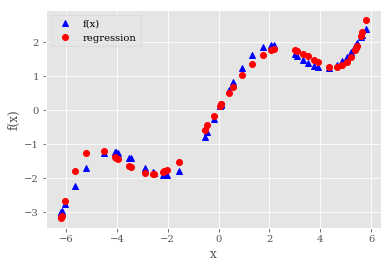
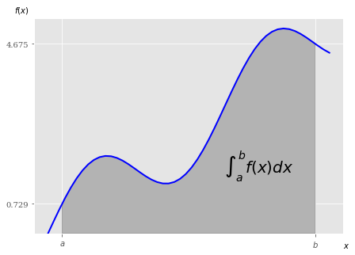

<br>

# Python for Finance

**Analyze Big Financial Data**

O'Reilly (2014)

Yves Hilpisch


**Buy the book ** |
<a href='http://shop.oreilly.com/product/0636920032441.do' target='_blank'>O'Reilly</a> |
<a href='http://www.amazon.com/Yves-Hilpisch/e/B00JCYHHJM' target='_blank'>Amazon</a>

**All book codes & IPYNBs** |
<a href="http://oreilly.quant-platform.com">http://oreilly.quant-platform.com</a>

**The Python Quants GmbH** | <a href='http://tpq.io' target='_blank'>http://tpq.io</a>

**Contact us** | <a href='mailto:pff@tpq.io'>pff@tpq.io</a>

# Mathematical Tools(数学工具)


```python
from pylab import plt
plt.style.use('ggplot')
import matplotlib as mpl
mpl.rcParams['font.family'] = 'serif'
```

## 1 Approximation(逼近法)


```python
import numpy as np
import matplotlib.pyplot as plt
%matplotlib inline
```


```python
def f(x):
    return np.sin(x) + 0.5 * x
```


```python
x = np.linspace(-2 * np.pi, 2 * np.pi, 50)
```


```python
plt.plot(x, f(x), 'b')
plt.grid(True)
plt.xlabel('x')
plt.ylabel('f(x)',rotation = 0)
# tag: sin_plot
# title: Example function plot
# size: 60
```


    <matplotlib.text.Text at 0x21d43fb0ba8>


### 1.1 Regression(回归)
回归是相当高效的函数近似计算工具。它不仅适合求取一维函数的近似值，在更高维度上也很有效。

本质上，回归的任务是在给定一组所谓的“基函数”$b_d,  d\in \{1, \cdots, D\}$的情况下，根据公式1-1找出最优参数$\alpha_1^*, \cdots, \alpha_D^*$,其中对于$i \in \{1, \cdots, I\}$观察点，$y_i \equiv f(x_i)$.

公式1-1：最小化回归问题
$$\min_{\alpha_1, \cdots, \alpha_D} \frac{1}{I} \sum_{i=1}^{I}\left(y_i - \sum_{d=1}^{D}\alpha_d \cdot b_d(x_i)\right)^2$$

转化为矩阵形式：

$$I = len(x)$$
$$x = np.array(x_1, \cdots, x_I)$$ 
$$y = np.array(y_i, \cdots, y_I)$$
$$b = np.array(b_1, \cdots, b_D)$$

$$\rho = np.array(\alpha_1^*, \cdots, \alpha_D^*) = \min_A  \frac{1}{I} \|y - A \cdot b(x)  \|_2^2$$


#### Monomials as Basis Functions(作为基函数的单项式)

即 $b_1 = 1, b_2 = x, b_3 = x^2, b_4 = x^3, \cdots$

NumPy有确定最优参数(`ployfit`)和以一组输入值求取近似值(`polyval`)的内建函数。

在`ployfit`返回的最优回归相关系数$\rho$基础上，np.polyval($\rho$, x)返回$x$坐标的回归值。

ployfit函数数参数：

参数|描述
:-:|:-
`x`|`x`坐标(自变量值)
`y`|`y`坐标(因变量值)
`deg`|多项式拟合度
`full`|若为真，返回额外的诊断信息
`w`|应用到`y`坐标的权重
`cov`|若为真，返回协方差矩阵


```python
reg = np.polyfit(x, f(x), deg=1)
ry = np.polyval(reg, x)
```


```python
np.polyfit?
```


```python
plt.plot(x, f(x), 'b', label='f(x)')
plt.plot(x, ry, 'r.', label='regression')
plt.legend(loc=0)
plt.grid(True)
plt.xlabel('x')
plt.ylabel('f(x)')
# tag: sin_plot_reg_1
plt.title('Example function and linear regression')
# size: 60
```


    <matplotlib.text.Text at 0x21d4411c198>


```python
reg = np.polyfit(x, f(x), deg=5)
ry = np.polyval(reg, x)
```


```python
plt.plot(x, f(x), 'b', label='f(x)')
plt.plot(x, ry, 'r.', label='regression')
plt.legend(loc=0)
plt.grid(True)
plt.xlabel('x')
plt.ylabel('f(x)')
# tag: sin_plot_reg_2
plt.title('Regression with monomials up to order 5')
# size: 60
```


    <matplotlib.text.Text at 0x21d441cedd8>


```python
reg = np.polyfit(x, f(x), 7)
ry = np.polyval(reg, x)
```


```python
plt.plot(x, f(x), 'b', label='f(x)')
plt.plot(x, ry, 'r.', label='regression')
plt.legend(loc=0)
plt.grid(True)
plt.xlabel('x')
plt.ylabel('f(x)')
# tag: sin_plot_reg_3
plt.title('Regression with monomials up to order 7')
# size: 60
```


    <matplotlib.text.Text at 0x21d443443c8>


```python
np.allclose(f(x), ry)
```


    False


均方差(MSE):


```python
np.sum((f(x) - ry) ** 2) / len(x)
```


    0.0017769134759517628


#### Individual Basis Functions(单独的基函数)
此时，必须使用NumPy ndarray对象


```python
m = np.zeros((3 + 1, len(x)))    # 初始化
# 
m[3, :] = x ** 3
m[2, :] = x ** 2
m[1, :] = x
m[0, :] = 1
```

numpy.linalg子库提供**lstsq**函数，以解决和公式1-1类似的最小二乘优化问题：


```python
np.linalg.lstsq(m.T, f(x))
```


    (array([  1.13227125e-16,   5.62777448e-01,   4.44089210e-16,
             -5.43553615e-03]),
     array([ 18.70019638]),
     4,
     array([ 703.78757296,  130.00970131,   10.44694523,    4.7085911 ]))


```python
reg = np.linalg.lstsq(m.T, f(x))[0]   # 返回
```


```python
ry = np.dot(reg, m)
```


```python
plt.plot(x, f(x), 'b', label='f(x)')
plt.plot(x, ry, 'r.', label='regression')
plt.legend(loc=0)
plt.grid(True)
plt.xlabel('x')
plt.ylabel('f(x)')
# tag: sin_plot_reg_4
plt.title('Regression via least-squares function')
# size: 60
```


    <matplotlib.text.Text at 0x21d444016a0>


```python
matrix[3, :] = np.sin(x)
reg = np.linalg.lstsq(matrix.T, f(x))[0]
ry = np.dot(reg, matrix)
```


```python
plt.plot(x, f(x), 'b', label='f(x)')
plt.plot(x, ry, 'r.', label='regression')
plt.legend(loc=0)
plt.grid(True)
plt.xlabel('x')
plt.ylabel('f(x)')
# tag: sin_plot_reg_5
# title: Regression using individual functions
# size: 60
```


    <matplotlib.text.Text at 0x21d443de780>


```python
np.allclose(f(x), ry)
```


    True


```python
np.sum((f(x) - ry) ** 2) / len(x)
```


    8.6444980367832195e-31


```python
reg
```


    array([  3.73659739e-16,   5.00000000e-01,   0.00000000e+00,
             1.00000000e+00])


#### Noisy Data(有噪声的数据)


```python
xn = np.linspace(-2 * np.pi, 2 * np.pi, 50)
xn = xn + 0.15 * np.random.standard_normal(len(xn))
yn = f(xn) + 0.25 * np.random.standard_normal(len(xn))
```


```python
reg = np.polyfit(xn, yn, 7)
ry = np.polyval(reg, xn)
```


```python
plt.plot(xn, yn, 'b^', label='f(x)')
plt.plot(xn, ry, 'ro', label='regression')
plt.legend(loc=0)
plt.grid(True)
plt.xlabel('x')
plt.ylabel('f(x)')
# tag: sin_plot_reg_6
# title: Regression with noisy data
# size: 60
```


    <matplotlib.text.Text at 0x21d4454a780>


#### Unsorted Data(未排序的数据)


```python
xu = np.random.rand(50) * 4 * np.pi - 2 * np.pi
yu = f(xu)
```


```python
print(xu[:10].round(2))
print(yu[:10].round(2))
```

    [ 3.5  -1.57 -2.01 -0.44  3.32  0.11 -2.18  0.11  1.73 -6.17]
    [ 1.4  -1.79 -1.91 -0.64  1.48  0.16 -1.91  0.17  1.85 -2.97]
    


```python
reg = np.polyfit(xu, yu, 5)
ry = np.polyval(reg, xu)
```


```python
plt.plot(xu, yu, 'b^', label='f(x)')
plt.plot(xu, ry, 'ro', label='regression')
plt.legend(loc=0)
plt.grid(True)
plt.xlabel('x')
plt.ylabel('f(x)')
# tag: sin_plot_reg_7
# title: Regression with unsorted data
# size: 60
```


    <matplotlib.text.Text at 0x21d4455f748>





#### Multiple Dimensions(多维)


```python
def fm(p):
    x, y = p
    return np.sin(x) + 0.25 * x + np.sqrt(y) + 0.05 * y ** 2
```


```python
x = np.linspace(0, 10, 20)
y = np.linspace(0, 10, 20)
X, Y = np.meshgrid(x, y)
  # generates 2-d grids out of the 1-d arrays
Z = fm((X, Y))
x = X.flatten()
y = Y.flatten()
  # yields 1-d arrays from the 2-d grids
```


```python
from mpl_toolkits.mplot3d import Axes3D
import matplotlib as mpl

fig = plt.figure(figsize=(9, 6))
ax = fig.gca(projection='3d')
surf = ax.plot_surface(X, Y, Z, rstride=2, cstride=2, cmap=mpl.cm.coolwarm,
        linewidth=0.5, antialiased=True)
ax.set_xlabel('x')
ax.set_ylabel('y')
ax.set_zlabel('f(x, y)')
fig.colorbar(surf, shrink=0.5, aspect=5)
# tag: sin_plot_3d_1
# title: Function with two parameters
# size: 60
```


    <matplotlib.colorbar.Colorbar at 0x21d447bea90>


```python
# 基函数
matrix = np.zeros((len(x), 6 + 1))
matrix[:, 6] = np.sqrt(y)
matrix[:, 5] = np.sin(x)
matrix[:, 4] = y ** 2
matrix[:, 3] = x ** 2
matrix[:, 2] = y
matrix[:, 1] = x
matrix[:, 0] = 1
```

**statsmodels**库提供了**OLS**函数，可以用于一维和多维最小二乘回归：

OLS的使用详见<http://bit.ly/using_ols>


```python
import statsmodels.api as sm
```

    C:\ProgramData\Anaconda3\lib\site-packages\statsmodels\compat\pandas.py:56: FutureWarning: The pandas.core.datetools module is deprecated and will be removed in a future version. Please use the pandas.tseries module instead.
      from pandas.core import datetools
    


```python
model = sm.OLS(fm((x, y)), matrix).fit()
```

OLS函数的好处之一提供关于回归及其质量的大量附加信息。调用`model.summary`可以访问结果的一个摘要。单独统计数字(如确定系数)通常可以直接访问：


```python
model.rsquared
```


    1.0


最优回归参数保存在model对象的`params`属性中：


```python
a = model.params
a
```


    array([ -4.16333634e-16,   2.50000000e-01,   4.02455846e-16,
            -4.85722573e-16,   5.00000000e-02,   1.00000000e+00,
             1.00000000e+00])


`reg_func`函数返回给定最优回归参数和自变量数据点的回归函数值：


```python
def reg_func(a, p):
    x, y = p
    f6 = a[6] * np.sqrt(y)
    f5 = a[5] * np.sin(x)
    f4 = a[4] * y ** 2
    f3 = a[3] * x ** 2
    f2 = a[2] * y
    f1 = a[1] * x
    f0 = a[0] * 1
    return (f6 + f5 + f4 + f3 +
            f2 + f1 + f0)
```

然后，将这些值与示例函数原始构成比较：


```python
RZ = reg_func(a, (X, Y))
```


```python
fig = plt.figure(figsize=(9, 6))
ax = fig.gca(projection='3d')
surf1 = ax.plot_surface(X, Y, Z, rstride=2, cstride=2,
            cmap=mpl.cm.coolwarm, linewidth=0.5,
            antialiased=True)
surf2 = ax.plot_wireframe(X, Y, RZ, rstride=2, cstride=2,
                          label='regression')
ax.set_xlabel('x')
ax.set_ylabel('y')
ax.set_zlabel('f(x, y)')
ax.legend()
fig.colorbar(surf, shrink=0.5, aspect=5)
# tag: sin_plot_3d_2
# title: Higher dimension regression
# size: 60
```


    <matplotlib.colorbar.Colorbar at 0x21d47a8ab38>


### Interpolation(插值)

样条插值：
- 仅适用于有排序且无噪声的数据。    
- 仅限于低维问题。

基本思路：给定一组有序的观测点(按照x轴排序)，在两个相邻的数据点之间进行回归，不仅产生的分段插值函数完全匹配数据点，而且函数在数据点上连续可微分。


```python
import scipy.interpolate as spi
```


```python
x = np.linspace(-2 * np.pi, 2 * np.pi, 25)
```


```python
def f(x):
    return np.sin(x) + 0.5 * x
```

在给定以x排序的数据点集时，应用这种方法和`polyfit`、`polyval`一样简单，此时对应的函数为`splrep`、`splev`.


```python
ipo = spi.splrep(x, f(x), k=1)
```


```python
iy = spi.splev(x, ipo)
```


```python
plt.plot(x, f(x), 'b', label='f(x)')
plt.plot(x, iy, 'r.', label='interpolation')
plt.legend(loc=0)
plt.grid(True)
plt.xlabel('x')
plt.ylabel('f(x)')
# tag: sin_plot_ipo_1
# title: Example plot with linear interpolation
# size: 60
```


    <matplotlib.text.Text at 0x21d47c59d68>


```python
np.allclose(f(x), iy)
```


    True


```python
xd = np.linspace(1.0, 3.0, 50)
iyd = spi.splev(xd, ipo)
```


```python
plt.plot(xd, f(xd), 'b', label='f(x)')
plt.plot(xd, iyd, 'r.', label='interpolation')
plt.legend(loc=0)
plt.grid(True)
plt.xlabel('x')
plt.ylabel('f(x)')
# tag: sin_plot_ipo_2
# title: Example plot (detail) with linear interpolation
# size: 60
```


    <matplotlib.text.Text at 0x21d47b337f0>


```python
ipo = spi.splrep(x, f(x), k=3)
iyd = spi.splev(xd, ipo)
```


```python
plt.plot(xd, f(xd), 'b', label='f(x)')
plt.plot(xd, iyd, 'r.', label='interpolation')
plt.legend(loc=0)
plt.grid(True)
plt.xlabel('x')
plt.ylabel('f(x)')
# tag: sin_plot_ipo_3
# title: Example plot (detail) with cubic splines interpolation
# size: 60
```


    <matplotlib.text.Text at 0x21d47c28978>


```python
np.allclose(f(xd), iyd)
```


    False


```python
np.sum((f(xd) - iyd) ** 2) / len(xd)
```


    1.1349319851436252e-08


## 2 Convex Optimization(凸优化)


```python
def fm(p):
    x, y = p
    return (np.sin(x) + 0.05 * x ** 2
          + np.sin(y) + 0.05 * y ** 2)
```


```python
x = np.linspace(-10, 10, 50)
y = np.linspace(-10, 10, 50)
X, Y = np.meshgrid(x, y)
Z = fm((X, Y))
```


```python
fig = plt.figure(figsize=(9, 6))
ax = fig.gca(projection='3d')
surf = ax.plot_surface(X, Y, Z, rstride=2, cstride=2, cmap=mpl.cm.coolwarm,
        linewidth=0.5, antialiased=True)
ax.set_xlabel('x')
ax.set_ylabel('y')
ax.set_zlabel('f(x, y)')
fig.colorbar(surf, shrink=0.5, aspect=5)
# tag: opt_plot_3d
# title: Function to minimize with two parameters
# size: 60
```


    <matplotlib.colorbar.Colorbar at 0x21d47e3dcf8>


从图中可以看出，此函数有多个局部最小值。


```python
import scipy.optimize as spo
```

### Global Optimization(全局最优)

为了更仔细的观察初始化最小过程时后台发生的情况，我们改善原函数，通过一个选项输出当前参数值和函数值。


```python
def fo(p):
    x, y = p
    z = np.sin(x) + 0.05 * x ** 2 + np.sin(y) + 0.05 * y ** 2
    if output == True:
        print('%8.4f %8.4f %8.4f' % (x, y, z))
    return z
```

`brute`以参数范围作为输入，返回最优化参数x, y 的值:


```python
output = True
spo.brute(fo, ((-10, 10.1, 5), (-10, 10.1, 5)), finish=None)
```

    -10.0000 -10.0000  11.0880
    -10.0000 -10.0000  11.0880
    -10.0000  -5.0000   7.7529
    -10.0000   0.0000   5.5440
    -10.0000   5.0000   5.8351
    -10.0000  10.0000  10.0000
     -5.0000 -10.0000   7.7529
     -5.0000  -5.0000   4.4178
     -5.0000   0.0000   2.2089
     -5.0000   5.0000   2.5000
     -5.0000  10.0000   6.6649
      0.0000 -10.0000   5.5440
      0.0000  -5.0000   2.2089
      0.0000   0.0000   0.0000
      0.0000   5.0000   0.2911
      0.0000  10.0000   4.4560
      5.0000 -10.0000   5.8351
      5.0000  -5.0000   2.5000
      5.0000   0.0000   0.2911
      5.0000   5.0000   0.5822
      5.0000  10.0000   4.7471
     10.0000 -10.0000  10.0000
     10.0000  -5.0000   6.6649
     10.0000   0.0000   4.4560
     10.0000   5.0000   4.7471
     10.0000  10.0000   8.9120
    


    array([ 0.,  0.])


```python
output = False
opt1 = spo.brute(fo, ((-10, 10.1, 0.1), (-10, 10.1, 0.1)), finish=None)
opt1
```


    array([-1.4, -1.4])


```python
fm(opt1)   # 全局最优解
```


    -1.7748994599769203


### Local Optimization(局部优化)
`fmin`函数的输入是需要最小化的函数和起始参数值，此外还可以定义输入参数宽容度和函数值宽容度，以及最大迭代和函数调用次数：


```python
output = True
opt2 = spo.fmin(fo, opt1, xtol=0.001, ftol=0.001, maxiter=15, maxfun=20)
opt2
```

     -1.4000  -1.4000  -1.7749
     -1.4700  -1.4000  -1.7743
     -1.4000  -1.4700  -1.7743
     -1.3300  -1.4700  -1.7696
     -1.4350  -1.4175  -1.7756
     -1.4350  -1.3475  -1.7722
     -1.4088  -1.4394  -1.7755
     -1.4438  -1.4569  -1.7751
     -1.4328  -1.4427  -1.7756
     -1.4591  -1.4208  -1.7752
     -1.4213  -1.4347  -1.7757
     -1.4235  -1.4096  -1.7755
     -1.4305  -1.4344  -1.7757
     -1.4168  -1.4516  -1.7753
     -1.4305  -1.4260  -1.7757
     -1.4396  -1.4257  -1.7756
     -1.4259  -1.4325  -1.7757
     -1.4259  -1.4241  -1.7757
     -1.4304  -1.4177  -1.7757
     -1.4270  -1.4288  -1.7757
    Warning: Maximum number of function evaluations has been exceeded.
    


    array([-1.42702972, -1.42876755])


```python
fm(opt2)
```


    -1.7757246992239009


下面陷入了“盆地跳跃(basin hopping)”


```python
output = False
spo.fmin(fo, (2.0, 2.0), maxiter=250)
```

    Optimization terminated successfully.
             Current function value: 0.015826
             Iterations: 46
             Function evaluations: 86
    


    array([ 4.2710728 ,  4.27106945])


### Constrained Optimization(有约束优化)

$$\min_{s,b} -\left(0.5 \cdot \sqrt{s \cdot 15 + b \cdot 5} + 0.5 \cdot \sqrt{s \cdot 5 + b \cdot 12}\right)$$
$$ 100 - s * 10 - b * 10 \geq 0$$
$$s, t \geq 0$$


```python
# function to be minimized
from math import sqrt
def Eu(p):
    s, b = p
    return -(0.5 * sqrt(s * 15 + b * 5) + 0.5 * sqrt(s * 5 + b * 12))

# constraints(约束条件)
cons = ({'type': 'ineq', 'fun': lambda p:  100 - p[0] * 10 - p[1] * 10})
  # budget constraint
bnds = ((0, 1000), (0, 1000))  # uppper bounds large enough
```


```python
result = spo.minimize(Eu, [5, 5], method='SLSQP',
                       bounds=bnds, constraints=cons)
```


```python
result
```


         fun: -9.700883611487832
         jac: array([-0.48508096, -0.48489535])
     message: 'Optimization terminated successfully.'
        nfev: 21
         nit: 5
        njev: 5
      status: 0
     success: True
           x: array([ 8.02547122,  1.97452878])


`minimize`函数输入需要最小化的函数，参数范围，返回一个字典对象，最优参数可由 `result['x']`读出：


```python
result['x']
```


    array([ 8.02547122,  1.97452878])


最优函数值可用`result['fun']`读出：


```python
-result['fun']
```


    9.700883611487832


```python
np.dot(result['x'], [10, 10])
```


    99.999999999999986


## 3 Integration(积分)

scipy.integrate函数提供数值积分所用函数：


```python
import scipy.integrate as sci
```

求解$\int_{0.5}^{9.5}{sin(x) + 0.5 x} {\rm d}x$


```python
def f(x):
    return np.sin(x) + 0.5 * x
```


```python
a = 0.5  # left integral limit
b = 9.5  # right integral limit
x = np.linspace(0, 10)
y = f(x)
```


```python
from matplotlib.patches import Polygon

fig, ax = plt.subplots(figsize=(7, 5))
plt.plot(x, y, 'b', linewidth=2)
plt.ylim(ymin=0)

# area under the function
# between lower and upper limit
Ix = np.linspace(a, b)
Iy = f(Ix)
verts = [(a, 0)] + list(zip(Ix, Iy)) + [(b, 0)]
poly = Polygon(verts, facecolor='0.7', edgecolor='0.5')
ax.add_patch(poly)

# labels
plt.text(0.75 * (a + b), 1.5, r"$\int_a^b f(x)dx$",
         horizontalalignment='center', fontsize=20)

plt.figtext(0.9, 0.075, '$x$')
plt.figtext(0.075, 0.9, '$f(x)$')

ax.set_xticks((a, b))
ax.set_xticklabels(('$a$', '$b$'))
ax.set_yticks([f(a), f(b)])
# tag: sin_integral
# title: Example function with integral area
# size: 50
```


    [<matplotlib.axis.YTick at 0x21d480a8630>,
     <matplotlib.axis.YTick at 0x21d479aac88>]





### Numerical Integration(数值积分)

##### 给定上下限


```python
sci.fixed_quad(f, a, b)[0]  # 固定高斯求积
```


    24.366995967084602


```python
sci.quad(f, a, b)[0]   # 自适应求积
```


    24.374754718086752


```python
sci.romberg(f, a, b)   # 勒贝格积分
```


    24.374754718086713


##### 以列表或者包含函数值的ndarray对象作为输入：


```python
xi = np.linspace(0.5, 9.5, 25)
```


```python
sci.trapz(f(xi), xi)     # 使用梯形法则
```


    24.352733271544516


```python
sci.simps(f(xi), xi)     # 使用辛普森法则
```


    24.374964184550748


### Integration by Simulation(通过蒙特卡洛模拟求取积分)


```python
for i in range(1, 20):
    np.random.seed(1000)
    x = np.random.random(i * 10) * (b - a) + a
    print(np.sum(f(x)) / len(x) * (b - a))
```

    24.8047622793
    26.5229188983
    26.2655475192
    26.0277033994
    24.9995418144
    23.8818101416
    23.5279122748
    23.507857659
    23.6723674607
    23.6794104161
    24.4244017079
    24.2390053468
    24.115396925
    24.4241919876
    23.9249330805
    24.1948421203
    24.1173483782
    24.1006909297
    23.7690510985
    

## 4 Symbolic Computation(符号计算)


```python
import sympy as sy
```

### Basics(基本知识)

**Sympy**引入了新的对象类。最基本的是**Symbol**类：


```python
x = sy.Symbol('x')
y = sy.Symbol('y')
```


```python
type(x)
```


    sympy.core.symbol.Symbol


和NumPy一样，Sympy由一些（数学）函数定义：


```python
sy.sqrt(x)
```


    sqrt(x)


尽管 x 没有数字值，但是Sympy已经定义了 x 的平方根，这是因为 x 是一个符号(Sympy)对象。在这个意义上，`sy.sqrt(x)`可以成为任何数学表达式的一部分。且Sympy通常自动简化给定的数学表达式：


```python
3 + sy.sqrt(x) - 4 ** 2
```


    sqrt(x) - 13


类似的，可以使用符号对象定义任何函数。它们不会与*Python*函数混淆。


```python
f = x ** 2 + 3 + 0.5 * x ** 2 + 3 / 2
```


```python
sy.simplify(f)
```


    1.5*x**2 + 4.5


Sympy为数学表达式提供了3个基本的渲染器：        
1. 基于LaTex的渲染器
2. 基于unicode的渲染器
3. 基于ASCII的渲染器


```python
sy.init_printing(pretty_print=False, use_unicode=False)
```


```python
print(sy.pretty(f))
```

         2      
    1.5*x  + 4.5
    


```python
print(sy.pretty(sy.sqrt(x) + 0.5))
```

      ___      
    \/ x  + 0.5
    


```python
pi_str = str(sy.N(sy.pi, 400000))
pi_str[:40]
```


    '3.14159265358979323846264338327950288419'


```python
pi_str[-40:]
```


    '8245672736856312185020980470362464176198'


```python
pi_str.find('111272')  # 查找你的生日
```


    366713


### Equations(方程式)

解方程$x^2 - 1 = 0$：


```python
sy.solve(x ** 2 - 1)
```


    [-1, 1]


一般来说，SymPy假定你寻找的是使指定表达式为0的方程的解。    
例如，求解$x^2 - 1 = 3$,需要如下操作：


```python
sy.solve(x ** 2 - 1 - 3)
```


    [-2, 2]


```python
sy.solve(x ** 3 + 0.5 * x ** 2 - 1)
```


    [0.858094329496553, -0.679047164748276 - 0.839206763026694*I, -0.679047164748276 + 0.839206763026694*I]


```python
sy.solve(x ** 2 + y ** 2)
```


    [{x: -I*y}, {x: I*y}]


### Integration(积分)


```python
a, b = sy.symbols('a b')
```


```python
print(sy.pretty(sy.Integral(sy.sin(x) + 0.5 * x, (x, a, b))))
```

      b                    
      /                    
     |                     
     |  (0.5*x + sin(x)) dx
     |                     
    /                      
    a                      
    

通过**integrate**函数可以得出积分的反导数（不定积分）：


```python
int_func = sy.integrate(sy.sin(x) + 0.5 * x, x)
```


```python
print(sy.pretty(int_func))
```

          2         
    0.25*x  - cos(x)
    

有了不定积分，求积分只需要三步：   
1. 求取SymPy表达式的值
2. 使用方法`subs`将数值代入对应的符号
3. 在新的表达式上调用方法`evalf`


```python
Fb = int_func.subs(x, 9.5).evalf()
Fa = int_func.subs(x, 0.5).evalf()
```


```python
Fb - Fa  # exact value of integral(积分的准确值)
```


    24.3747547180867


积分也可以用符号积分的上下限得到符号解：


```python
int_func_limits = sy.integrate(sy.sin(x) + 0.5 * x, (x, a, b))
print(sy.pretty(int_func_limits))
```

            2         2                  
    - 0.25*a  + 0.25*b  + cos(a) - cos(b)
    

代入数值，使用字典对象代表多个替代值，并求值可以得到积分值：


```python
int_func_limits.subs({a : 0.5, b : 9.5}).evalf()
```


    24.3747547180868


提供量化的积分上下限，进一步得出准确值：


```python
sy.integrate(sy.sin(x) + 0.5 * x, (x, 0.5, 9.5))
```


    24.3747547180867


### Differentiation(微分)


```python
int_func.diff()
```


    0.5*x + sin(x)


```python
f = (sy.sin(x) + 0.05 * x ** 2
   + sy.sin(y) + 0.05 * y ** 2)
```

为了最小化`f`，我们需要两个变量的偏微分：


```python
del_x = sy.diff(f, x) 
del_x
```


    0.1*x + cos(x)


```python
del_y = sy.diff(f, y)
del_y
```


    0.1*y + cos(y)


```python
xo = sy.nsolve(del_x, -1.5)
xo
```


    -1.42755177876459


```python
yo = sy.nsolve(del_y, -1.5)
yo
```


    -1.42755177876459


```python
f.subs({x : xo, y : yo}).evalf() 
  # global minimum
```


    -1.77572565314742


```python
xo = sy.nsolve(del_x, 1.5)
xo
```


    1.74632928225285


```python
yo = sy.nsolve(del_y, 1.5)
yo
```


    1.74632928225285


```python
f.subs({x : xo, y : yo}).evalf()
  # local minimum
```


    2.27423381055640


## 延伸阅读：  

+ NumPy的函数库：<http://docs.scipy.org!doc/numpy/reference/>
+ statsmodels 库: <http://statsmodels.sourceforge.net>
- scipy.optimize 的细节可以访问 <http:docs.scipy.org!d∞:/scipy/reference/optimize.html>
+ scipy.integrate 的积分运算在这里可以找到解释: <http://docs.scipy.org!doc/scipy/reference/integrate.html>
