参考资料：
- <http://www.matplotlib.org>    

- [Matplotlib 教程](https://liam0205.me/2014/09/11/matplotlib-tutorial-zh-cn/)


# Data Visualization(`数据的可视化`)

matplotlib是python最著名的绘图库，它提供了一整套和matlab相似的命令API，十分适合交互式地进行制图。而且也可以方便地将它作为绘图控件，嵌入GUI应用程序中。它的文档相当完备，并且[Gallery](https://matplotlib.org/gallery.html)页面中有上百幅缩略图，打开之后都有源程序。因此如果你需要绘制某种类型的图，只需要在这个页面中浏览/复制/粘贴一下，基本上都能搞定。


```python
from pylab import plt
plt.style.use('ggplot')
import matplotlib as mpl
mpl.rcParams['font.family'] = 'serif'
```

# `plot`函数
```json
Signature: plt.plot(*args, **kwargs)
Docstring:
Plot lines and/or markers to the
:class:`~matplotlib.axes.Axes`.  *args* is a variable length
argument, allowing for multiple *x*, *y* pairs with an
optional format string.  For example, each of the following is
legal::

    plot(x, y)        # plot x and y using default line style and color
    plot(x, y, 'bo')  # plot x and y using blue circle markers
    plot(y)           # plot y using x as index array 0..N-1
    plot(y, 'r+')     # ditto(同前), but with red plusses

If *x* and/or *y* is 2-dimensional, then the corresponding columns
will be plotted.

If used with labeled data, make sure that the color spec is not
included as an element in data, as otherwise the last case
``plot("v","r", data={"v":..., "r":...)``
can be interpreted as the first case which would do ``plot(v, r)``
using the default line style and color.

If not used with labeled data (i.e., without a data argument),
an arbitrary number of *x*, *y*, *fmt* groups can be specified, as in::

    a.plot(x1, y1, 'g^', x2, y2, 'g-')

Return value is a list of lines that were added.

By default, each line is assigned a different style specified by a
'style cycle'.  To change this behavior, you can edit the
axes.prop_cycle rcParam.

The following format string characters are accepted to control
the line style or marker:

================    ===============================
character           description
================    ===============================
``'-'``             solid line style(实线样式)
``'--'``            dashed line style(短划线样式)
``'-.'``            dash-dot line style(点实线样式)
``':'``             dotted line style(虚线样式)
``'.'``             point marker(点标记)
``','``             pixel marker(像素标记)
``'o'``             circle marker(圆标记)
``'v'``             triangle_down marker(向下三角形标记)
``'^'``             triangle_up marker(向上三角形标记)
``'<'``             triangle_left marker(向左三角形标记)
``'>'``             triangle_right marker(向右三角形标记)
``'1'``             tri_down marker
``'2'``             tri_up marker
``'3'``             tri_left marker
``'4'``             tri_right marker
``'s'``             square marker(方形标记)
``'p'``             pentagon marker(五边形形标记)
``'*'``             star marker(星号)
``'h'``             hexagon1 marker(六角形形标记1)
``'H'``             hexagon2 marker(六角形形标记2)
``'+'``             plus marker(加号)
``'x'``             x marker(X标记)
``'D'``             diamond marker(菱形标记)
``'d'``             thin_diamond marker(细菱形标记)
``'|'``             vline marker(垂直标记)
``'_'``             hline marker
================    ===============================


The following color abbreviations are supported:

==========  ========
character   color
==========  ========
'b'         blue(蓝)
'g'         green(绿)
'r'         red(红)
'c'         cyan(青)
'm'         magenta(品红)
'y'         yellow(黄)
'k'         black(黑)
'w'         white(白)
==========  ========

In addition, you can specify colors in many weird and
wonderful ways, including full names (``'green'``), hex
strings (``'#008000'``), RGB or RGBA tuples (``(0,1,0,1)``) or
grayscale intensities as a string (``'0.8'``).  Of these, the
string specifications can be used in place of a ``fmt`` group,
but the tuple forms can be used only as ``kwargs``.

Line styles and colors are combined in a single format string, as in
``'bo'`` for blue circles.

The *kwargs* can be used to set line properties (any property that has
a ``set_*`` method).  You can use this to set a line label (for auto
legends), linewidth, anitialising, marker face color, etc.  Here is an
example::

    plot([1,2,3], [1,2,3], 'go-', label='line 1', linewidth=2)
    plot([1,2,3], [1,4,9], 'rs',  label='line 2')
    axis([0, 4, 0, 10])
    legend()

If you make multiple lines with one plot command, the kwargs
apply to all those lines, e.g.::

    plot(x1, y1, x2, y2, antialiased=False)

Neither line will be antialiased.

You do not need to use format strings, which are just
abbreviations.  All of the line properties can be controlled
by keyword arguments.  For example, you can set the color,
marker, linestyle, and markercolor with::

    plot(x, y, color='green', linestyle='dashed', marker='o',
         markerfacecolor='blue', markersize=12).

See :class:`~matplotlib.lines.Line2D` for details.

The kwargs are :class:`~matplotlib.lines.Line2D` properties:

  agg_filter: unknown
  alpha: float (0.0 transparent through 1.0 opaque) 
  animated: [True | False] 
  antialiased or aa: [True | False] 
  axes: an :class:`~matplotlib.axes.Axes` instance 
  clip_box: a :class:`matplotlib.transforms.Bbox` instance 
  clip_on: [True | False] 
  clip_path: [ (:class:`~matplotlib.path.Path`, :class:`~matplotlib.transforms.Transform`) | :class:`~matplotlib.patches.Patch` | None ] 
  color or c: any matplotlib color 
  contains: a callable function 
  dash_capstyle: ['butt' | 'round' | 'projecting'] 
  dash_joinstyle: ['miter' | 'round' | 'bevel'] 
  dashes: sequence of on/off ink in points 
  drawstyle: ['default' | 'steps' | 'steps-pre' | 'steps-mid' | 'steps-post'] 
  figure: a :class:`matplotlib.figure.Figure` instance 
  fillstyle: ['full' | 'left' | 'right' | 'bottom' | 'top' | 'none'] 
  gid: an id string 
  label: string or anything printable with '%s' conversion. 
  linestyle or ls: ['solid' | 'dashed', 'dashdot', 'dotted' | (offset, on-off-dash-seq) | ``'-'`` | ``'--'`` | ``'-.'`` | ``':'`` | ``'None'`` | ``' '`` | ``''``]
  linewidth or lw: float value in points 
  marker: :mod:`A valid marker style <matplotlib.markers>`
  markeredgecolor or mec: any matplotlib color 
  markeredgewidth or mew: float value in points 
  markerfacecolor or mfc: any matplotlib color 
  markerfacecoloralt or mfcalt: any matplotlib color 
  markersize or ms: float 
  markevery: [None | int | length-2 tuple of int | slice | list/array of int | float | length-2 tuple of float]
  path_effects: unknown
  picker: float distance in points or callable pick function ``fn(artist, event)`` 
  pickradius: float distance in points 
  rasterized: [True | False | None] 
  sketch_params: unknown
  snap: unknown
  solid_capstyle: ['butt' | 'round' |  'projecting'] 
  solid_joinstyle: ['miter' | 'round' | 'bevel'] 
  transform: a :class:`matplotlib.transforms.Transform` instance 
  url: a url string 
  visible: [True | False] 
  xdata: 1D array 
  ydata: 1D array 
  zorder: any number 

kwargs *scalex* and *scaley*, if defined, are passed on to
:meth:`~matplotlib.axes.Axes.autoscale_view` to determine
whether the *x* and *y* axes are autoscaled; the default is
*True*.

.. note::
    In addition to the above described arguments, this function can take a
    **data** keyword argument. If such a **data** argument is given, the
    following arguments are replaced by **data[<arg>]**:

    * All arguments with the following names: 'x', 'y'.

Type:      function
```

## Two-Dimensional Plotting(二维绘图)


```python
import numpy as np
import matplotlib as mpl
import matplotlib.pyplot as plt
import warnings; warnings.simplefilter('ignore')
%matplotlib inline
```

### One-Dimensional Data Set(一维数据集)


```python
np.random.seed(1000)
y = np.random.standard_normal(20)    # 生成20个标准正态分布(伪)随机数
```


```python
x = range(len(y))
plt.plot(x, y)
# tag: matplotlib_0
# title: Plot given x- and y-values
```


    [<matplotlib.lines.Line2D at 0x23894cd03c8>]


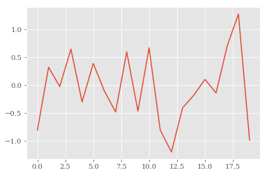


```python
plt.plot(y)  # 以索引值作为对应的x值
# tag: matplotlib_1
# title: Plot given data as 1d-array
```


    [<matplotlib.lines.Line2D at 0x23894da5d30>]


```python
plt.plot(y,'b+')
```


    [<matplotlib.lines.Line2D at 0x23895eaa588>]


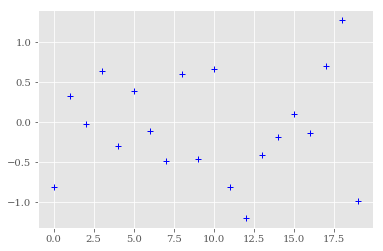


```python
plt.plot(y.cumsum())
# tag: matplotlib_2
# title: Plot given a 1d-array with method attached
```


    [<matplotlib.lines.Line2D at 0x238961845c0>]


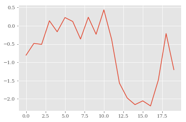


```python
plt.plot(y.cumsum())
plt.grid(True)  # adds a grid(网格)
plt.axis('tight')  # adjusts the axis ranges
# tag: matplotlib_3_a
# title: Plot with grid and tight axes
```


    (-0.95000000000000007,
     19.949999999999999,
     -2.3228186637490449,
     0.56550858086558653)


#### 坐标轴的设置
```json
Signature: plt.axis(*v, **kwargs)
Docstring:
Convenience method to get or set axis properties.

Calling with no arguments::

  >>> axis()

返回当前坐标轴限值 ``[xmin, xmax, ymin, ymax]``.::

  >>> axis(v)

sets the min and max of the x and y axes, with
``v = [xmin, xmax, ymin, ymax]``.::

  >>> axis('off')

关闭坐标轴线和标签::

  >>> axis('equal')

changes limits of *x* or *y* axis so that equal increments of *x*
and *y* have the same length; a circle is circular.(使用等刻线)::

  >>> axis('scaled')

achieves the same result by changing the dimensions of the plot box instead
of the axis data limits.::

  >>> axis('tight')

changes *x* and *y* axis limits such that all data is shown.(缩小限值) If
all data is already shown, it will move it to the center of the
figure without modifying (*xmax* - *xmin*) or (*ymax* -
*ymin*). Note this is slightly different than in MATLAB.::

  >>> axis('image')

is 'scaled' with the axis limits equal to the data limits(数据限值).::

  >>> axis('auto')

and::

  >>> axis('normal')

are deprecated. They restore default behavior; axis limits are automatically
scaled to make the data fit comfortably within the plot box.

if ``len(*v)==0``, you can pass in *xmin*, *xmax*, *ymin*, *ymax*
as kwargs selectively to alter just those limits without changing
the others.

  >>> axis('square')

changes the limit ranges (*xmax*-*xmin*) and (*ymax*-*ymin*) of
the *x* and *y* axes to be the same, and have the same scaling,
resulting in a square plot.

The xmin, xmax, ymin, ymax tuple is returned

.. seealso::

    :func:`xlim`, :func:`ylim`
       For setting the x- and y-limits individually.
Type:      function
```


```python
plt.plot(y.cumsum())
plt.grid(True) 
plt.axis('image') 
```


    (-0.95000000000000007,
     19.949999999999999,
     -2.3228186637490449,
     0.56550858086558653)


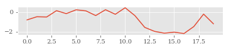


```python
# 使用plt.xlim，plt.ylim设置每个坐标轴的最值
plt.plot(y.cumsum())
plt.grid(True)
plt.xlim(-1, 20)
plt.ylim(np.min(y.cumsum()) - 1,
         np.max(y.cumsum()) + 1)
# tag: matplotlib_3_b
# title: Plot with custom axes limits
```


    (-3.1915310617211072, 1.4342209788376488)


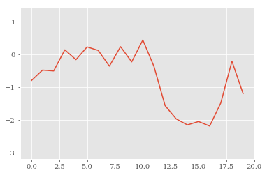


#### 设置标题
```json
Signature: plt.title(s, *args, **kwargs)
Docstring:
Set a title of the current axes.

Set one of the three available axes titles. The available titles are
positioned above the axes in the center, flush with the left edge,
and flush with the right edge.

.. seealso::
    See :func:`~matplotlib.pyplot.text` for adding text
    to the current axes

Parameters
----------
label : str
    Text to use for the title

fontdict : dict
    A dictionary controlling the appearance of the title text,
    the default `fontdict` is:

        {'fontsize': rcParams['axes.titlesize'],
        'fontweight' : rcParams['axes.titleweight'],
        'verticalalignment': 'baseline',
        'horizontalalignment': loc}

loc : {'center', 'left', 'right'}, str, optional
    Which title to set, defaults to 'center'

Returns
-------
text : :class:`~matplotlib.text.Text`
    The matplotlib text instance representing the title

Other parameters
----------------
kwargs : text properties
    Other keyword arguments are text properties, see
    :class:`~matplotlib.text.Text` for a list of valid text
    properties.
Type:      function
```

#### 设置标签
```json
Signature: plt.xlabel(s, *args, **kwargs)
Docstring:
Set the *x* axis label of the current axis.

Default override is::

  override = {
      'fontsize'            : 'small',
      'verticalalignment'   : 'top',
      'horizontalalignment' : 'center'
      }

.. seealso::

    :func:`~matplotlib.pyplot.text`
        For information on how override and the optional args work
Type:      function
```


```python
plt.figure(figsize=(7, 4))
  # the figsize parameter defines the
  # size of the figure in (width, height)
plt.plot(y.cumsum(), 'b', lw=1.5)   # `lw` 表示线宽
plt.plot(y.cumsum(), 'ro')
plt.grid(True)
plt.axis('tight')
plt.xlabel('index')
plt.ylabel('value')
plt.title('A Simple Plot')
# tag: matplotlib_4
# title: Plot with typical labels
```


    <matplotlib.text.Text at 0x238963e40f0>


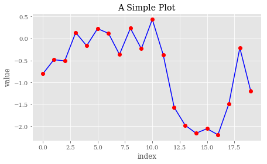


#### plt.figure
```json
Signature: plt.def figure(num=None,  # autoincrement if None, else integer from 1-N
           figsize=None,  # defaults to rc figure.figsize
           dpi=None,  # defaults to rc figure.dpi
           facecolor=None,  # defaults to rc figure.facecolor
           edgecolor=None,  # defaults to rc figure.edgecolor
           frameon=True,
           FigureClass=Figure,
           **kwargs
           )

Docstring:
Creates a new figure.

Parameters
----------

num : integer or string, optional, default: none
    If not provided, a new figure will be created, and the figure number
    will be incremented. The figure objects holds this number in a `number`
    attribute.
    If num is provided, and a figure with this id already exists, make
    it active, and returns a reference to it. If this figure does not
    exists, create it and returns it.
    If num is a string, the window title will be set to this figure's
    `num`.

figsize : tuple of integers, optional, default: None
    width, height in inches. If not provided, defaults to rc
    figure.figsize.

dpi : integer, optional, default: None
    resolution of the figure. If not provided, defaults to rc figure.dpi.

facecolor :
    the background color. If not provided, defaults to rc figure.facecolor

edgecolor :
    the border color. If not provided, defaults to rc figure.edgecolor

Returns
-------
figure : Figure
    The Figure instance returned will also be passed to new_figure_manager
    in the backends, which allows to hook custom Figure classes into the
    pylab interface. Additional kwargs will be passed to the figure init
    function.

Notes
-----
If you are creating many figures, make sure you explicitly call "close"
on the figures you are not using, because this will enable pylab
to properly clean up the memory.

rcParams defines the default values, which can be modified in the
matplotlibrc file
Type:      function
```

### Two-Dimensional Data Set


```python
np.random.seed(2000)
y = np.random.standard_normal((20, 2)).cumsum(axis=0)
```


```python
plt.figure(figsize=(7, 4))
plt.plot(y, lw=1.5)
  # plots two lines
plt.plot(y, 'ro')
  # plots two dotted lines
plt.grid(True)
plt.axis('tight')
plt.xlabel('index')
plt.ylabel('value')
plt.title('A Simple Plot')
# tag: matplotlib_5
# title: Plot with two data sets
```


    <matplotlib.text.Text at 0x238964d35f8>


```python
plt.figure(figsize=(7, 4))
plt.plot(y[:, 0], lw=1.5, label='1st')
plt.plot(y[:, 1], lw=1.5, label='2nd')
plt.plot(y, 'ro')
plt.grid(True)
# legend接受不同的位置参数
plt.legend(loc=0)   # 0 表示最佳位置，即图例尽可能少的遮盖数据
plt.axis('tight')
plt.xlabel('index')
plt.ylabel('value')
plt.title('A Simple Plot')
# tag: matplotlib_6
# title: Plot with labeled data sets
```


    <matplotlib.text.Text at 0x23896585eb8>


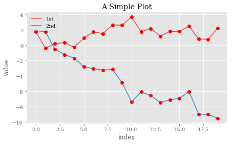


```json

        ===============   =============
        Location String   Location Code
        ===============   =============
        'best'            0
        'upper right'     1
        'upper left'      2
        'lower left'      3
        'lower right'     4
        'right'           5
        'center left'     6
        'center right'    7
        'lower center'    8
        'upper center'    9
        'center'          10
        ===============   =============
```


```python
y[:, 0] = y[:, 0] * 100
plt.figure(figsize=(7, 4))
plt.plot(y[:, 0], lw=1.5, label='1st')
plt.plot(y[:, 1], lw=1.5, label='2nd')
plt.plot(y, 'ro')
plt.grid(True)
plt.legend(loc=0)
plt.axis('tight')
plt.xlabel('index')
plt.ylabel('value')
plt.title('A Simple Plot')
# tag: matplotlib_7
# title: Plot with one scaled(刻度) data sets
# 可能会导致可视化信息丢失
```


    <matplotlib.text.Text at 0x2389665f668>


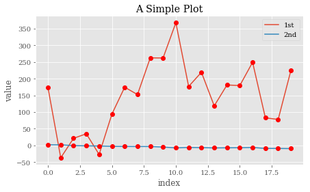


解决上述问题有两种基本方法：    
1. 使用2个y轴(左/右)
2. 使用2个子图(上/下，左/右)

### plt.subplot

使用plt.subplot函数，可以直接访问底层绘图对象(图、子图等)

可参考matplotlib展厅<http://matplotlib.org/gallery.html>

```json
Signature: plt.subplot(*args, **kwargs)
Docstring:
Return a subplot axes positioned by the given grid definition.

Typical call signature::

  subplot(nrows, ncols, plot_number)

Where *nrows* and *ncols* are used to notionally split the figure
into ``nrows * ncols`` sub-axes, and *plot_number* is used to identify
the particular subplot that this function is to create within the notional
grid. *plot_number* starts at 1, increments across rows first and has a
maximum of ``nrows * ncols``.
(*nrows*,*ncols*分别指定行数，列数；*plot_number*指定子图编号（从1到``nrows * ncols``）)

In the case when *nrows*, *ncols* and *plot_number* are all less than 10,
a convenience exists, such that the a 3 digit number can be given instead,
where the hundreds represent *nrows*, the tens represent *ncols* and the
units represent *plot_number*. For instance::
(三个参数之间可以不使用逗号隔开)
  subplot(211)

produces a subaxes in a figure which represents the top plot (i.e. the
first) in a 2 row by 1 column notional grid (no grid actually exists,
but conceptually this is how the returned subplot has been positioned).

.. note::

   Creating a subplot will delete any pre-existing subplot that overlaps
   with it beyond sharing a boundary::

      import matplotlib.pyplot as plt
      # plot a line, implicitly creating a subplot(111)
      plt.plot([1,2,3])
      # now create a subplot which represents the top plot of a grid
      # with 2 rows and 1 column. Since this subplot will overlap the
      # first, the plot (and its axes) previously created, will be removed
      plt.subplot(211)
      plt.plot(range(12))
      plt.subplot(212, facecolor='y') # creates 2nd subplot with yellow background

   If you do not want this behavior, use the
   :meth:`~matplotlib.figure.Figure.add_subplot` method or the
   :func:`~matplotlib.pyplot.axes` function instead.

Keyword arguments:

  *facecolor*:
    The background color of the subplot, which can be any valid
    color specifier.  See :mod:`matplotlib.colors` for more
    information.

  *polar*:
    A boolean flag indicating whether the subplot plot should be
    a polar projection.  Defaults to *False*.

  *projection*:
    A string giving the name of a custom projection to be used
    for the subplot. This projection must have been previously
    registered. See :mod:`matplotlib.projections`.

.. seealso::

    :func:`~matplotlib.pyplot.axes`
        For additional information on :func:`axes` and
        :func:`subplot` keyword arguments.

    :file:`examples/pie_and_polar_charts/polar_scatter_demo.py`
        For an example

**Example:**

.. plot:: mpl_examples/subplots_axes_and_figures/subplot_demo.py

Type:      function
```


```python
fig, ax1 = plt.subplots() # 使用第一个数轴(left)画第一个数据集
plt.plot(y[:, 0], 'b', lw=1.5, label='1st')
plt.plot(y[:, 0], 'ro')
plt.grid(True)
plt.legend(loc=8)
plt.axis('tight')
plt.xlabel('index')
plt.ylabel('value 1st')
plt.title('A Simple Plot')

ax2 = ax1.twinx()  # 使用第二个数轴(right)画第二个数据集
plt.plot(y[:, 1], 'g', lw=1.5, label='2nd')
plt.plot(y[:, 1], 'ro')
plt.legend(loc=0)
plt.ylabel('value 2nd')
# tag: matplotlib_8
# title: Plot with two data sets and two y-axes
#  Plot with two differently scaled(刻度) data sets，
```


    <matplotlib.text.Text at 0x238961367f0>


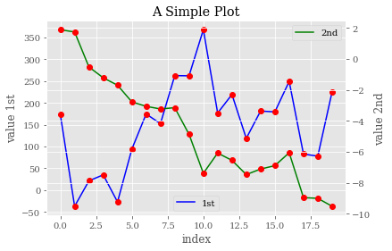


```python
plt.figure(figsize=(7, 5))
plt.subplot(211)
plt.plot(y[:, 0], lw=1.5, label='1st')
plt.plot(y[:, 0], 'ro')
plt.grid(True)
plt.legend(loc=0)
plt.axis('tight')
plt.ylabel('value')
plt.title('A Simple Plot')
plt.subplot(212)
plt.plot(y[:, 1], 'g', lw=1.5, label='2nd')
plt.plot(y[:, 1], 'ro')
plt.grid(True)
plt.legend(loc=0)
plt.axis('tight')
plt.xlabel('index')
plt.ylabel('value')
# tag: matplotlib_9
# title: Plot with two sub-plots
```


    <matplotlib.text.Text at 0x2389630e7f0>


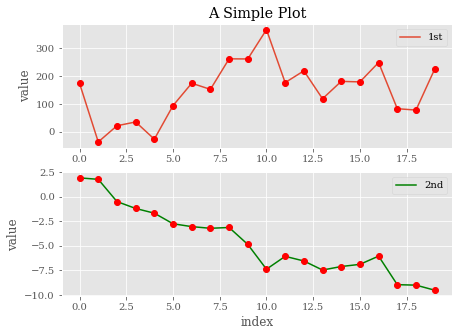


```python
plt.figure(figsize=(9, 4))
plt.subplot(121)
plt.plot(y[:, 0], lw=1.5, label='1st')
plt.plot(y[:, 0], 'ro')
plt.grid(True)
plt.legend(loc=0)
plt.axis('tight')
plt.xlabel('index')
plt.ylabel('value')
plt.title('1st Data Set')
plt.subplot(122)
plt.bar(np.arange(len(y)), y[:, 1], width=0.5,
        color='g', label='2nd')
plt.grid(True)
plt.legend(loc=0)
plt.axis('tight')
plt.xlabel('index')
plt.title('2nd Data Set')
# tag: matplotlib_10
# title: Plot combining line/point sub-plot with bar sub-plot
# size: 80
```


    <matplotlib.text.Text at 0x238967ddf98>


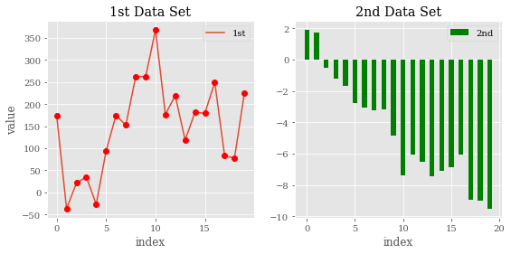


### Other Plot Styles


```python
y = np.random.standard_normal((1000, 2))
```


```python
plt.figure(figsize=(7, 5))
plt.plot(y[:, 0], y[:, 1], 'ro')
plt.grid(True)
plt.xlabel('1st')
plt.ylabel('2nd')
plt.title('Scatter Plot')
# tag: matplotlib_11_a
# title: Scatter plot via +plot+ function
```


    <matplotlib.text.Text at 0x2389690c080>


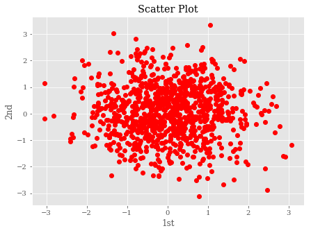


#### scatter函数画出散点图


```python
plt.figure(figsize=(7, 5))
plt.scatter(y[:, 0], y[:, 1], marker='o')
plt.grid(True)
plt.xlabel('1st')
plt.ylabel('2nd')
plt.title('Scatter Plot')
# tag: matplotlib_11_b
# title: Scatter plot via +scatter+ function
```


    <matplotlib.text.Text at 0x238969ab8d0>


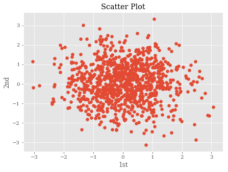


Scatter函数可以加入第三维，通过不同的颜色进行可视化，并使用彩条加以描述。为此，我们需要用随机数据生成第三个数据集 `c`。     
不同颜色的小点用来表示第三维：


```python
c = np.random.randint(0, 10, len(y))
```


```python
plt.figure(figsize=(7, 5))
plt.scatter(y[:, 0], y[:, 1], c=c, marker='o')
plt.colorbar()
plt.grid(True)
plt.xlabel('1st')
plt.ylabel('2nd')
plt.title('Scatter Plot')
# tag: matplotlib_11_c
# title: Scatter plot with third dimension
```


    <matplotlib.text.Text at 0x23896a57208>


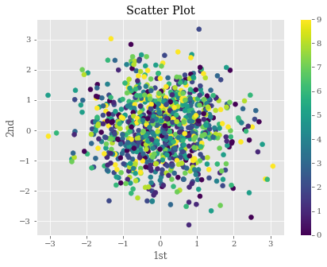


#### hist  直方图

```json
hist(x, bins=None, range=None, normed=False, weights=None, cumulative=False,
         bottom=None, histtype='bar', align='mid', orientation='vertical',
         rwidth=None, log=False, color=None, label=None, stacked=False,
         hold=None, data=None, **kwargs)

Compute and draw the histogram of *x*. The return value is a
tuple (*n*, *bins*, *patches*) or ([*n0*, *n1*, ...], *bins*,
[*patches0*, *patches1*,...]) if the input contains multiple
data.

Multiple data can be provided via *x* as a list of datasets
of potentially different length ([*x0*, *x1*, ...]), or as
a 2-D ndarray in which each column is a dataset.  Note that
the ndarray form is transposed relative to the list form.

Masked arrays are not supported at present.

Parameters
----------
x : (n,) array or sequence of (n,) arrays
    Input values, this takes either a single array or a sequency of
    arrays which are not required to be of the same length

bins : integer or array_like or 'auto', optional
    If an integer is given, `bins + 1` bin edges are returned,
    consistently with :func:`numpy.histogram` for numpy version >=
    1.3.

    Unequally spaced bins are supported if `bins` is a sequence.

    If Numpy 1.11 is installed, may also be ``'auto'``.

    Default is taken from the rcParam ``hist.bins``.

range : tuple or None, optional
    The lower and upper range of the bins. Lower and upper outliers
    are ignored. If not provided, `range` is (x.min(), x.max()). Range
    has no effect if `bins` is a sequence.

    If `bins` is a sequence or `range` is specified, autoscaling
    is based on the specified bin range instead of the
    range of x.

    Default is ``None``

normed : boolean, optional
    If `True`, the first element of the return tuple will
    be the counts normalized to form a probability density, i.e.,
    ``n/(len(x)`dbin)``, i.e., the integral of the histogram will sum
    to 1. If *stacked* is also *True*, the sum of the histograms is
    normalized to 1.

    Default is ``False``

weights : (n, ) array_like or None, optional
    An array of weights, of the same shape as `x`.  Each value in `x`
    only contributes its associated weight towards the bin count
    (instead of 1).  If `normed` is True, the weights are normalized,
    so that the integral of the density over the range remains 1.

    Default is ``None``

cumulative : boolean, optional
    If `True`, then a histogram is computed where each bin gives the
    counts in that bin plus all bins for smaller values. The last bin
    gives the total number of datapoints.  If `normed` is also `True`
    then the histogram is normalized such that the last bin equals 1.
    If `cumulative` evaluates to less than 0 (e.g., -1), the direction
    of accumulation is reversed.  In this case, if `normed` is also
    `True`, then the histogram is normalized such that the first bin
    equals 1.

    Default is ``False``

bottom : array_like, scalar, or None
    Location of the bottom baseline of each bin.  If a scalar,
    the base line for each bin is shifted by the same amount.
    If an array, each bin is shifted independently and the length
    of bottom must match the number of bins.  If None, defaults to 0.

    Default is ``None``

histtype : {'bar', 'barstacked', 'step',  'stepfilled'}, optional
    The type of histogram to draw.

    - 'bar' is a traditional bar-type histogram.  If multiple data
      are given the bars are aranged side by side.

    - 'barstacked' is a bar-type histogram where multiple
      data are stacked on top of each other.

    - 'step' generates a lineplot that is by default
      unfilled.

    - 'stepfilled' generates a lineplot that is by default
      filled.

    Default is 'bar'

align : {'left', 'mid', 'right'}, optional
    Controls how the histogram is plotted.

        - 'left': bars are centered on the left bin edges.

        - 'mid': bars are centered between the bin edges.

        - 'right': bars are centered on the right bin edges.

    Default is 'mid'

orientation : {'horizontal', 'vertical'}, optional
    If 'horizontal', `~matplotlib.pyplot.barh` will be used for
    bar-type histograms and the *bottom* kwarg will be the left edges.

rwidth : scalar or None, optional
    The relative width of the bars as a fraction of the bin width.  If
    `None`, automatically compute the width.

    Ignored if `histtype` is 'step' or 'stepfilled'.

    Default is ``None``

log : boolean, optional
    If `True`, the histogram axis will be set to a log scale. If `log`
    is `True` and `x` is a 1D array, empty bins will be filtered out
    and only the non-empty (`n`, `bins`, `patches`) will be returned.

    Default is ``False``

color : color or array_like of colors or None, optional
    Color spec or sequence of color specs, one per dataset.  Default
    (`None`) uses the standard line color sequence.

    Default is ``None``

label : string or None, optional
    String, or sequence of strings to match multiple datasets.  Bar
    charts yield multiple patches per dataset, but only the first gets
    the label, so that the legend command will work as expected.

    default is ``None``

stacked : boolean, optional
    If `True`, multiple data are stacked on top of each other If
    `False` multiple data are aranged side by side if histtype is
    'bar' or on top of each other if histtype is 'step'

    Default is ``False``

Returns
-------
n : array or list of arrays
    The values of the histogram bins. See **normed** and **weights**
    for a description of the possible semantics. If input **x** is an
    array, then this is an array of length **nbins**. If input is a
    sequence arrays ``[data1, data2,..]``, then this is a list of
    arrays with the values of the histograms for each of the arrays
    in the same order.

bins : array
    The edges of the bins. Length nbins + 1 (nbins left edges and right
    edge of last bin).  Always a single array even when multiple data
    sets are passed in.

patches : list or list of lists
    Silent list of individual patches used to create the histogram
    or list of such list if multiple input datasets.

Other Parameters
----------------
kwargs : `~matplotlib.patches.Patch` properties

See also
--------
hist2d : 2D histograms

Notes
-----
Until numpy release 1.5, the underlying numpy histogram function was
incorrect with `normed`=`True` if bin sizes were unequal.  MPL
inherited that error.  It is now corrected within MPL when using
earlier numpy versions.

Examples
--------
.. plot:: mpl_examples/statistics/histogram_demo_features.py

.. note::
    In addition to the above described arguments, this function can take a
    **data** keyword argument. If such a **data** argument is given, the
    following arguments are replaced by **data[<arg>]**:

    * All arguments with the following names: 'weights', 'x'.
Type:      function
```


```python
plt.figure(figsize=(7, 4))
plt.hist(y, label=['1st', '2nd'], bins=25)
plt.grid(True)
plt.legend(loc=0)
plt.xlabel('value')
plt.ylabel('frequency')
plt.title('Histogram')
# tag: matplotlib_12_a
# title: Histogram for two data sets
```


    <matplotlib.text.Text at 0x23896b81c50>


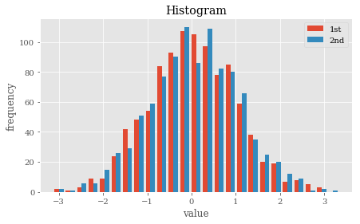


```python
plt.figure(figsize=(7, 4))
plt.hist(y, label=['1st', '2nd'], color=['b', 'g'],
            stacked=True, bins=20)
plt.grid(True)
plt.legend(loc=0)
plt.xlabel('value')
plt.ylabel('frequency')
plt.title('Histogram')
# tag: matplotlib_12_b
# title: Stacked histogram for two data sets(两个数据集堆叠的直方图)
```


    <matplotlib.text.Text at 0x23896d1beb8>


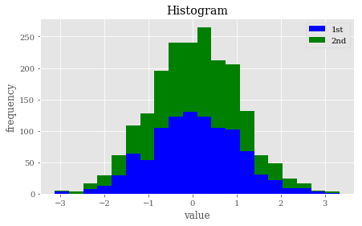


```python
fig, ax = plt.subplots(figsize=(7, 4))
plt.boxplot(y)
plt.grid(True)
plt.setp(ax, xticklabels=['1st', '2nd'])
plt.xlabel('data set')
plt.ylabel('value')
plt.title('Boxplot')
# tag: matplotlib_13
# title: Boxplot(箱形图) for two data sets
# size: 70
```


    <matplotlib.text.Text at 0x23896e88780>


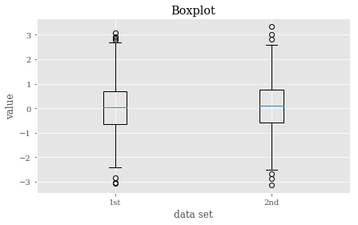


#### 带`Latex`公式的图表


```python
from matplotlib.patches import Polygon
def func(x):
    return 0.5 * np.exp(x) + 1

a, b = 0.5, 1.5  # integral limits
x = np.linspace(0, 2)
y = func(x)

fig, ax = plt.subplots(figsize=(7, 5))
plt.plot(x, y, 'b', linewidth=2)
plt.ylim(ymin=0)

# Illustrate the integral value, i.e. the area under the function
# between lower and upper limit
Ix = np.linspace(a, b)
Iy = func(Ix)
verts = [(a, 0)] + list(zip(Ix, Iy)) + [(b, 0)]
poly = Polygon(verts, facecolor='0.7', edgecolor='0.5')
ax.add_patch(poly)

plt.text(0.5 * (a + b), 1, r"$\int_a^b f(x)\mathrm{d}x$",
         horizontalalignment='center', fontsize=20)

plt.figtext(0.9, 0.075, '$x$')
plt.figtext(0.075, 0.9, '$f(x)$')

ax.set_xticks((a, b))
ax.set_xticklabels(('$a$', '$b$'))
ax.set_yticks([func(a), func(b)])
ax.set_yticklabels(('$f(a)$', '$f(b)$'))
plt.grid(True)
# tag: matplotlib_math
# title: Exponential function, integral area and Latex labels
# size: 60
```


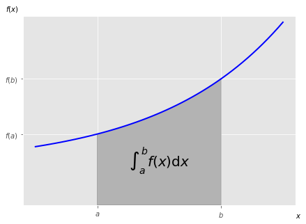


## 3d Plotting

```json
Signature: np.meshgrid(*xi, **kwargs)
Docstring:
Return coordinate(坐标) matrices(方阵) from coordinate vectors.

Make N-D coordinate arrays for vectorized evaluations of
N-D scalar/vector fields over N-D grids, given
one-dimensional coordinate arrays x1, x2,..., xn.

.. versionchanged:: 1.9
   1-D and 0-D cases are allowed.

Parameters
----------
x1, x2,..., xn : array_like
    1-D arrays representing the coordinates of a grid.
indexing : {'xy', 'ij'}, optional
    Cartesian ('xy', default) or matrix ('ij') indexing of output.
    See Notes for more details.

    .. versionadded:: 1.7.0
sparse : bool, optional
    If True a sparse grid is returned in order to conserve memory.
    Default is False.

    .. versionadded:: 1.7.0
copy : bool, optional
    If False, a view into the original arrays are returned in order to
    conserve memory.  Default is True.  Please note that
    ``sparse=False, copy=False`` will likely return non-contiguous
    arrays.  Furthermore, more than one element of a broadcast array
    may refer to a single memory location.  If you need to write to the
    arrays, make copies first.

    .. versionadded:: 1.7.0

Returns
-------
X1, X2,..., XN : ndarray
    For vectors `x1`, `x2`,..., 'xn' with lengths ``Ni=len(xi)`` ,
    return ``(N1, N2, N3,...Nn)`` shaped arrays if indexing='ij'
    or ``(N2, N1, N3,...Nn)`` shaped arrays if indexing='xy'
    with the elements of `xi` repeated to fill the matrix along
    the first dimension for `x1`, the second for `x2` and so on.

Notes
-----
This function supports both indexing conventions through the indexing
keyword argument.  Giving the string 'ij' returns a meshgrid with
matrix indexing, while 'xy' returns a meshgrid with Cartesian indexing.
In the 2-D case with inputs of length M and N, the outputs are of shape
(N, M) for 'xy' indexing and (M, N) for 'ij' indexing.  In the 3-D case
with inputs of length M, N and P, outputs are of shape (N, M, P) for
'xy' indexing and (M, N, P) for 'ij' indexing.  The difference is
illustrated by the following code snippet::

    xv, yv = np.meshgrid(x, y, sparse=False, indexing='ij')
    for i in range(nx):
        for j in range(ny):
            # treat xv[i,j], yv[i,j]

    xv, yv = np.meshgrid(x, y, sparse=False, indexing='xy')
    for i in range(nx):
        for j in range(ny):
            # treat xv[j,i], yv[j,i]

In the 1-D and 0-D case, the indexing and sparse keywords have no effect.

See Also
--------
index_tricks.mgrid : Construct a multi-dimensional "meshgrid"
                 using indexing notation.
index_tricks.ogrid : Construct an open multi-dimensional "meshgrid"
                 using indexing notation.

Examples
--------
>>> nx, ny = (3, 2)
>>> x = np.linspace(0, 1, nx)
>>> y = np.linspace(0, 1, ny)
>>> xv, yv = np.meshgrid(x, y)
>>> xv
array([[ 0. ,  0.5,  1. ],
       [ 0. ,  0.5,  1. ]])
>>> yv
array([[ 0.,  0.,  0.],
       [ 1.,  1.,  1.]])
>>> xv, yv = np.meshgrid(x, y, sparse=True)  # make sparse output arrays
>>> xv
array([[ 0. ,  0.5,  1. ]])
>>> yv
array([[ 0.],
       [ 1.]])

`meshgrid` is very useful to evaluate functions on a grid.

>>> x = np.arange(-5, 5, 0.1)
>>> y = np.arange(-5, 5, 0.1)
>>> xx, yy = np.meshgrid(x, y, sparse=True)
>>> z = np.sin(xx**2 + yy**2) / (xx**2 + yy**2)
>>> h = plt.contourf(x,y,z)
Type:      function
```


```python
strike = np.linspace(50, 150, 24)
ttm = np.linspace(0.5, 2.5, 24)
strike, ttm = np.meshgrid(strike, ttm)
```


```python
strike[:2]
```


    array([[  50.        ,   54.34782609,   58.69565217,   63.04347826,
              67.39130435,   71.73913043,   76.08695652,   80.43478261,
              84.7826087 ,   89.13043478,   93.47826087,   97.82608696,
             102.17391304,  106.52173913,  110.86956522,  115.2173913 ,
             119.56521739,  123.91304348,  128.26086957,  132.60869565,
             136.95652174,  141.30434783,  145.65217391,  150.        ],
           [  50.        ,   54.34782609,   58.69565217,   63.04347826,
              67.39130435,   71.73913043,   76.08695652,   80.43478261,
              84.7826087 ,   89.13043478,   93.47826087,   97.82608696,
             102.17391304,  106.52173913,  110.86956522,  115.2173913 ,
             119.56521739,  123.91304348,  128.26086957,  132.60869565,
             136.95652174,  141.30434783,  145.65217391,  150.        ]])


```python
iv = (strike - 100) ** 2 / (100 * strike) / ttm
  # generate fake implied volatilities
```


```python
from mpl_toolkits.mplot3d import Axes3D

fig = plt.figure(figsize=(9, 6))
ax = fig.gca(projection='3d')

surf = ax.plot_surface(strike, ttm, iv, rstride=2, cstride=2,
                       cmap=plt.cm.coolwarm, linewidth=0.5,
                       antialiased=True)

ax.set_xlabel('strike')
ax.set_ylabel('time-to-maturity')
ax.set_zlabel('implied volatility')

fig.colorbar(surf, shrink=0.5, aspect=5)
# tag: matplotlib_17
# title: 3d surface plot for (fake) implied volatilities
# size: 70
```


    <matplotlib.colorbar.Colorbar at 0x1897be00b70>


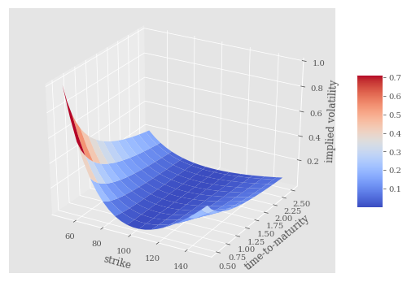


```json
plot_surface(self, X, Y, Z, *args, **kwargs)
Docstring:
Create a surface plot.

By default it will be colored in shades of a solid color,
but it also supports color mapping by supplying the *cmap*
argument.

The `rstride` and `cstride` kwargs set the stride used to
sample the input data to generate the graph.  If 1k by 1k
arrays are passed in, the default values for the strides will
result in a 100x100 grid being plotted. Defaults to 10.
Raises a ValueError if both stride and count kwargs
(see next section) are provided.

The `rcount` and `ccount` kwargs supersedes `rstride` and
`cstride` for default sampling method for surface plotting.
These arguments will determine at most how many evenly spaced
samples will be taken from the input data to generate the graph.
This is the default sampling method unless using the 'classic'
style. Will raise ValueError if both stride and count are
specified.
Added in v2.0.0.

============= ================================================
Argument      Description
============= ================================================
*X*, *Y*, *Z* Data values as 2D arrays
*rstride*     Array row stride (step size)(数组行距)
*cstride*     Array column stride (step size)(数组列距)
*rcount*      Use at most this many rows, defaults to 50
*ccount*      Use at most this many columns, defaults to 50
*color*       Color of the surface patches(曲面块颜色)
*cmap*        A colormap for the surface patches.(曲面块颜色映射)
*facecolors*  Face colors for the individual patches(单独曲面块表面颜色)
*norm*        An instance of Normalize to map values to colors(将值映射为颜色的Normalize实例)
*vmin*        Minimum value to map
*vmax*        Maximum value to map
*shade*       Whether to shade the facecolors
============= ================================================

Other arguments are passed on to
:class:`~mpl_toolkits.mplot3d.art3d.Poly3DCollection`
Type:      method
```


```python
fig = plt.figure(figsize=(8, 5))
ax = fig.add_subplot(111, projection='3d')
ax.view_init(30, 60)  # 设置视角

ax.scatter(strike, ttm, iv, zdir='z', s=25,
           c='b', marker='^')

ax.set_xlabel('strike')
ax.set_ylabel('time-to-maturity')
ax.set_zlabel('implied volatility')

# tag: matplotlib_18
# title: 3d scatter plot for (fake) implied volatilities
# size: 70
```


    <matplotlib.text.Text at 0x1897c0737b8>


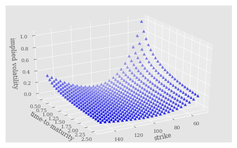


```json
Signature: ax.view_init(elev=None, azim=None)
Docstring:
Set the elevation and azimuth of the axes.

This can be used to rotate the axes programatically.

'elev' stores the elevation angle in the z plane.
'azim' stores the azimuth angle in the x,y plane.

if elev or azim are None (default), then the initial value
is used which was specified in the :class:`Axes3D` constructor.
Type:      method
```

延伸阅读：

- [User’s Guide](http://matplotlib.org/users/)
- [2D绘图](http://matplotlib.org/users/pyplot_tutorial.html)
- [3D绘图](http://matplotlib.org/mpl_toolkits/mplot3d/tutorial.html)
